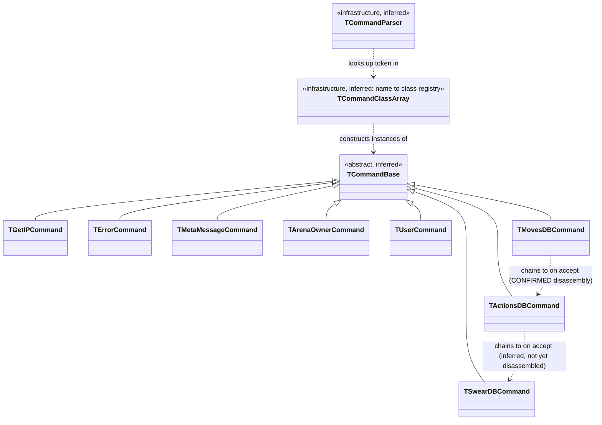
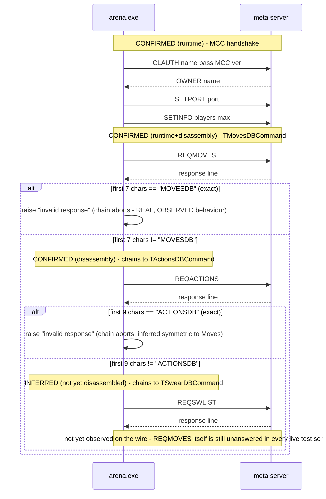

# GITR2K (Get In The Ring 2000) — Protocol Specification
**Living document. Update this file as captures/ fills in with real traffic — never upgrade a confidence level without evidence.**

Confidence levels used throughout this project:
- `CONFIRMED (runtime)` — verified by observing real client/arena traffic (a file under `captures/`).
- `CONFIRMED (disassembly)` — verified directly in the compiled binaries.
- `STRONG INFERENCE` — not proven, but follows tightly from confirmed evidence.
- `UNKNOWN` — genuinely undetermined. Marked explicitly rather than guessed.

---

## 1. Infrastructure (all CONFIRMED by disassembly)

| Fact | Value | Source |
|---|---|---|
| Meta server hostname | `GETINTR2K.MINIDNS.NET` | Default `Host` property, `TIdTCPClient`-family component, both `gitr2k.exe` (`GITRNewsList`) and `arena.exe` (`GMCC`) |
| Meta server port | `9182` | Decoded `Port` property (`0x23DE` LE) in both binaries |
| arena.exe listening port | `7072` | Decoded `Port`/`DefaultPort` properties (`0x1BA0` LE) on `arena.exe`'s `GITRServer` component |
| Registry key | `HKCU\Software\SIPSolutions\GITR2000` | `TRegAuto.RegPath` in both binaries' forms |
| Networking stack | Delphi + Indy (`TIdTCPConnection`/`TIdTCPClient`/`TIdTCPServer`) | Class names visible in compiled RTTI/DFM data |
| Resolver | Standard Winsock `gethostbyname`/`WSAAsyncGetHostByName` | Import table / string analysis — no custom DNS, no hardcoded IP fallback found |

**STRONG INFERENCE:** Windows `HOSTS` file redirection of `GETINTR2K.MINIDNS.NET` should be sufficient to point the client/arena.exe at a replacement server — no binary patching confirmed necessary. This still hasn't been tested directly (our first successful runtime test used a binary-patched client instead, on a machine without admin rights to edit `HOSTS`), so it remains unconfirmed either way.

**CONFIRMED (runtime, 2026-07-23):** Redirecting both the host and port the client/arena.exe connect to (tested via direct binary patch of the DFM-embedded `Host`/`Port` properties, not `HOSTS`) is sufficient for both clients to establish a TCP connection and begin sending real protocol traffic. See `captures/2026-07-23_first_real_capture.txt`.

---

## 2. Known protocol tokens (CONFIRMED to exist in the binaries — semantics mostly UNKNOWN)

The presence of a string in the compiled code confirms the program *recognizes* that token somewhere. It does **not** confirm argument format, delimiters, direction, or expected response — those require a runtime capture.

| Token | Found in | Direction (assumed) | Confidence of token existence | Confidence of everything else |
|---|---|---|---|---|
| `GETNEWS` | gitr2k.exe | client→server | CONFIRMED (disassembly) | UNKNOWN |
| `GITRNEWS` | gitr2k.exe | server→client | CONFIRMED (disassembly) | UNKNOWN |
| `ENDNEWSLIST` | gitr2k.exe | server→client | CONFIRMED (disassembly) | UNKNOWN |
| `GETWELCOMEMSG` / `WELCOMEMSG` | gitr2k.exe | both directions (assumed) | CONFIRMED (disassembly) | UNKNOWN |
| `METAARENALIST` | gitr2k.exe | server→client (assumed) | CONFIRMED (disassembly) — exists exactly once in the binary | UNKNOWN — handler not yet located, see §4 |
| `ENDARENALIST` | gitr2k.exe | server→client (assumed) | CONFIRMED (disassembly) | UNKNOWN |
| `USERENTER` / `USERLEAVE` | gitr2k.exe | server→client (assumed) | CONFIRMED (disassembly) | UNKNOWN |
| `SENDCHAT` / `CHATID` | gitr2k.exe | client→server (assumed) | CONFIRMED (disassembly) | UNKNOWN |
| `BASECHAT` | arena.exe | n/a — used internally as a check value | CONFIRMED (disassembly) — used inside the disassembled `GMCCMetaMessage` handler | UNKNOWN semantics |
| `METAMSG` (note: literal string is `"METAMSG "` with a trailing space) | arena.exe | server→client (assumed) | CONFIRMED (disassembly) — literal constant used in `GMCCMetaMessage` | STRONG INFERENCE that message framing is `METAMSG <space><rest of line>` |
| `CHALLENGE` / `DENYCHALLENGE` | gitr2k.exe | client↔server (assumed) | CONFIRMED (disassembly) | UNKNOWN |
| `FIGHTSTART` / `FIGHTSTOP` | gitr2k.exe | server→client (assumed) | CONFIRMED (disassembly) | UNKNOWN |
| `PINGECHO` | gitr2k.exe | client↔server (assumed keepalive) | CONFIRMED (disassembly) | UNKNOWN exact framing |
| `PING` | arena.exe | client↔server (assumed keepalive) | CONFIRMED (disassembly) | UNKNOWN exact framing |
| `YOURIP` | gitr2k.exe | server→client (assumed) | CONFIRMED (disassembly) | UNKNOWN |
| `SETDIVIDER` | gitr2k.exe | server→client (assumed) | CONFIRMED (disassembly) | **Important**: suggests the field delimiter may be assigned dynamically by the server rather than fixed. Treat the delimiter as UNKNOWN until confirmed either way. |
| `CHATREQ`, `FIGHTREQ`, `GRANTOP`, `KICKUSER`, `SETADMINLIST`, `SETBANLIST`, `SETMAXNUM`, `SETWELCOMEMSG` | arena.exe only | assumed admin/host-side commands | CONFIRMED (disassembly) | UNKNOWN |
| `CLAUTH` | both `gitr2k.exe` and `arena.exe` | client→server | CONFIRMED (runtime) — see §3, it's the envelope wrapping every outbound command, not an arena.exe-only admin verb as previously assumed | CONFIRMED (runtime) for framing/args; response format still UNKNOWN |
| `MCC` | arena.exe | client→server, as the `<COMMAND>` value inside a `CLAUTH` line | CONFIRMED (runtime) — not previously in this table at all | CONFIRMED (runtime, 2026-07-23) — arena.exe's registration/handshake with the meta server (matches the `GMCC` component name found via disassembly); acknowledged by an `OWNER <arena name>\r\n` response, see below |
| `RETRCOUNTRIES` | gitr2k.exe | client→server, sent bare (no `CLAUTH` envelope) | CONFIRMED (runtime) — not previously known | CONFIRMED (runtime) response shape — see §5 |
| `COUNTRY` | gitr2k.exe | server→client, per-country line prefix | CONFIRMED (disassembly) — found in the same string table as `METAARENALIST`/`ENDARENALIST` while investigating `RETRCOUNTRIES` | CONFIRMED (runtime) — needs a trailing arena-count field, see §5 |
| `ARENA` | gitr2k.exe | server→client, per-arena line prefix | CONFIRMED (disassembly), same table as above | STRONG INFERENCE (reused in both `METAARENALIST` and `RETRARENALIST` responses) — exact field set still being validated |
| `ENDCOUNTRYLIST` | gitr2k.exe | server→client, terminates a `RETRCOUNTRIES` response | CONFIRMED (disassembly), same table as above | CONFIRMED (runtime) — see §5 |
| `RETRARENALIST` | gitr2k.exe | client→server, sent bare with a country name argument | CONFIRMED (runtime) — brand new, not previously known at all, not even as a string constant we'd noticed | UNKNOWN — response is an active, disclosed guess, see §5 |
| `BOGUS` | gitr2k.exe | client→server, sent bare | CONFIRMED (runtime) — sent repeatedly, exactly every 40s, while a request sits unanswered | **RESOLVED (2026-07-23):** echoing it back verbatim over 6 consecutive cycles (4+ minutes) had zero effect - same 40s interval, no client behavior change. This is unrelated network-level keepalive noise, not a protocol-semantic message needing acknowledgment. No further action needed on this token. |
| `GETARENA` (literal constant is `"GETARENA "` with a trailing space) | gitr2k.exe | server→client (assumed), per-item line prefix candidate for `RETRARENALIST`'s response | CONFIRMED (disassembly) — found in the same string table as `ARENA`/`COUNTRY`/`ENDCOUNTRYLIST`, missed in the first analysis pass | UNKNOWN — being tested as of experiment #7, see §5 |
| `GRANTED` | arena.exe | UNKNOWN direction/usage | CONFIRMED (disassembly) — found near arena.exe's `GMCC.OnArenaOwner` handler | UNKNOWN — zero findable references anywhere in the binary, possibly dead code |
| `OWNER` | arena.exe | server→client, `MCC` acknowledgment token | CONFIRMED (disassembly) — found near `GMCC.OnArenaOwner`; its trivial getter function is actively referenced (unlike `GRANTED`) | **CONFIRMED (runtime, 2026-07-23)** — `OWNER <arena name>\r\n` sent in response to `MCC` causes arena.exe's activity log to show "connected" / "retrieving moves database" and unblocks three brand-new follow-up commands, see below |
| `SETPORT` | arena.exe | client→server, sent bare immediately after `MCC`/`OWNER` | CONFIRMED (runtime, 2026-07-23) — new token, not previously known | CONFIRMED (runtime) — `SETPORT <port>\r\n`, arena.exe self-reporting its real listening port (observed: `7072`), see §5 |
| `SETINFO` | arena.exe | client→server, sent bare immediately after `SETPORT` | CONFIRMED (runtime, 2026-07-23) — new token, not previously known | CONFIRMED (runtime) for shape — `SETINFO <a> <b>\r\n` (observed `0 15`); STRONG INFERENCE only for field meaning/order (assumed player_count, max_players), see §5 |
| `REQMOVES` | arena.exe | client→server, sent bare immediately after `SETINFO`, no arguments | CONFIRMED (runtime, 2026-07-23) — new token, not previously known | CONFIRMED (runtime+disassembly, 2026-07-23) — response is a single line, and must **not** exactly match the 7-char literal `MOVESDB` or arena.exe raises an "invalid response" exception; what response IS accepted is UNKNOWN, see §4/§5 |
| `MOVESDB` | arena.exe | n/a — a rejection trigger, not a response prefix | CONFIRMED (disassembly, 2026-07-23) — `TMovesDBCommand` class name, found clustered with `REQMOVES` and an "invalid response" error string | CONFIRMED (runtime+disassembly, cross-validated) that sending this exact literal as the response is **wrong** - triggers rejection, corrected after an initial (wrong) reading assumed the opposite. VMT reconstruction further shows this is stage one of a chained sequence continuing into `REQACTIONS`/`ACTIONSDB`, see §4/§5 |
| `REQACTIONS` / `ACTIONSDB` | arena.exe | client→server / rejection trigger | CONFIRMED (disassembly, 2026-07-23) — found via VMT reconstruction as the next stage chained directly after `MOVESDB`'s success branch, identical code shape | Not yet observed on the wire (unreachable while `REQMOVES` itself is unanswered); same rejection rule as `MOVESDB` applies, see §4 |

**Correction (2026-07-23):** an earlier pass of this document lumped `MOVESDB` in with `arena.exe`'s Pascal-like scripting keywords (`BEGIN`, `WHILE`, `FUNC`, `SCRIPT`, `PLUGIN`, `ACTIONSDB`, `SWEARDB`) as unrelated to the network protocol. That was **wrong for `MOVESDB` specifically** - disassembly now shows it's the real response-prefix literal for a genuine protocol command class, `TMovesDBCommand`, directly tied to the confirmed-runtime `REQMOVES` token (see §4). The other keywords in that list (`BEGIN`/`WHILE`/`FUNC`/`SCRIPT`/`PLUGIN`/`ACTIONSDB`) remain believed unrelated - they belong to an embedded scripting/plugin engine - but this should be treated as unconfirmed rather than dismissed outright, given this correction. `SWEARDB` (with request token `REQSWLIST`) turns out to be a near-identical sibling command class to `TMovesDBCommand`, likely a swear-word/chat-filter list - also a real protocol command, not a scripting keyword.

---

## 3. Login / authentication

**CONFIRMED (runtime, 2026-07-23)** — see `captures/2026-07-23_first_real_capture.txt`. Every outbound command from both clients is wrapped in a single-line envelope:

```
CLAUTH <username> <password> <COMMAND> <version>\r\n
```

- Fields are space-delimited (confirmed: exactly 4 spaces in every captured line, 5 fields total including `CLAUTH` itself), line-terminated with `\r\n`.
- This is sent **immediately on connect, before any other handshake** — answers open question #1 from §6. There is no separate login/handshake step before commands become meaningful; `CLAUTH` *is* the envelope, sent per-command, not once per session.
- Observed `<username>`/`<password>` values so far:
  - `gitr2k.exe` requesting `GITRNEWS` on startup: `NIL NIL` (both literal string `"NIL"`)
  - `gitr2k.exe` requesting `METAARENALIST` (from the arena-select dialog): empty-string username, literal `"NIL"` password — i.e. these two fields are **not** filled in consistently from one command to the next by the same unauthenticated session. Worth resolving once we've captured a command sent *after* an actual login.
  - `arena.exe` requesting `MCC`: username `"Test"` (the literal arena name typed into its GUI), password `"none"` (literal word, distinct from `gitr2k.exe`'s `"NIL"` placeholder)
- `<version>` was `0` in all three captures so far — UNKNOWN whether this is a fixed protocol version or something else entirely.
- Still **UNKNOWN**: what a real login (`Login as a Guest User` / `Register a Username` / `Login with current Username`) actually sends — none of our captures so far came from clicking those options.

**CONFIRMED (runtime, 2026-07-23, second session):** the `CLAUTH` envelope only wraps the *first* message sent on a connection — subsequent commands on the same already-open connection are sent bare, with no envelope at all. Observed directly: after receiving a response to `METAARENALIST`, `gitr2k.exe` sent a bare `RETRCOUNTRIES\r\n` on that same connection (see `captures/2026-07-23_first_real_capture.txt`, second session).

`RETRCOUNTRIES` is a previously-unknown token, discovered only because the real client sent it. Investigating it turned up `COUNTRY`, `ARENA`, and `ENDCOUNTRYLIST` as compiled string constants in `gitr2k.exe`, sitting in the *same* string-constant table as `METAARENALIST`/`ENDARENALIST` — real anchors we didn't know to look for before this. This is what the "Select Arena" dialog's "retrieving country list" status text is actually waiting on; the `METAARENALIST` response alone didn't satisfy it. See `commands/retrcountries.py` for the follow-up experimental response (untested as of this writing).

**CONFIRMED (runtime, 2026-07-23) - the real arena-discovery flow is a three-stage lazy hierarchy**, established by iterating the `RETRCOUNTRIES` response until the client accepted it, then observing what it did next:

1. `METAARENALIST` → still-unconfirmed ack/stub response
2. `RETRCOUNTRIES` → `COUNTRY <name> <arena_count>\r\n` per country, then `ENDCOUNTRYLIST\r\n` — **this exact shape is confirmed working**: the "Select Arena" tree populates cleanly (verified with an "International" node showing count 1)
3. `RETRARENALIST <country>` → sent automatically by the client once (2) succeeds, requesting that one country's actual arena details. A brand-new command, not previously known at all. Response is an active, disclosed guess (see `commands/retrarenalist.py`) reusing the already-known `ARENA`/`ENDARENALIST` tokens.

Also observed: `BOGUS\r\n`, sent bare ~38 seconds after a `RETRARENALIST` request got no response. **RESOLVED (2026-07-23):** confirmed via 6 observed cycles over 4+ minutes to repeat exactly every 40 seconds regardless of server response; echoing it back had zero effect. Concluded to be unrelated network-level keepalive noise, not a protocol-semantic message.

**CONFIRMED (runtime, 2026-07-23) — the `MCC` (arena registration) handshake is now unblocked.** After `RETRARENALIST` guessing stalled (7 attempts, all rejected/inconclusive), work shifted to arena.exe's registration flow instead, which had been stuck the entire time: its "Start" button stayed permanently disabled and its activity log stayed empty across every prior test, with no response ever sent to `MCC`. Sending `OWNER <arena name>\r\n` (e.g. `OWNER Test\r\n`) in response to `MCC` produced an immediate, real client reaction:

- arena.exe's activity log showed **"connected"** and then **"retrieving moves database"**
- three brand-new bare commands appeared on the same connection, in order: `SETPORT 7072\r\n`, then `SETINFO 0 15\r\n`, then `REQMOVES\r\n`

This confirms `OWNER <arena name>\r\n` is the correct (or at least sufficient) `MCC` acknowledgment. `SETPORT`/`SETINFO` are arena.exe self-reporting its real listening port and stats back to the meta server — both are now parsed and recorded into `ArenaRegistry` (see `commands/setport.py`, `commands/setinfo.py`, `server/registry.py`). `REQMOVES` matches the "retrieving moves database" status text but its response format is completely unknown; the server currently only observes/logs it (see `commands/reqmoves.py`) rather than guessing blind, per this project's isolate-one-variable methodology.

Since `SETPORT`/`SETINFO`/`REQMOVES` are all sent bare with no arena name repeated, they're correlated back to the arena that registered via `MCC` earlier on the same connection through the per-connection `context` dict (`context["arena_name"]`, set once by `commands/mcc.py` and read by the later handlers).

**Bug found and fixed (2026-07-23, same session):** the real capture showed `SETINFO 0 15\r\n` and `REQMOVES\r\n` arriving **coalesced in a single TCP `recv()`** (`SETINFO 0 15\r\nREQMOVES\r\n`, one packet). The server's connection handler previously passed each raw `recv()` chunk straight to the dispatcher unsplit, and the dispatcher only inspects the *first* token of whatever bytes it's given - so `REQMOVES` was silently dropped: never dispatched, never logged as `COMMAND_SEEN`. Fixed in `server/connection.py` by buffering incoming bytes and splitting on line boundaries (`\n`) before dispatching each line separately, so every command gets its own `dispatch()` call regardless of how the client batches them on the wire. This means arena.exe (and possibly gitr2k.exe) can and does coalesce multiple commands into one TCP segment - worth remembering for any future capture where a command "goes missing" from the log.

---

## 4. Dispatcher / handler functions located via disassembly

Using Delphi's compiled **published-method RTTI table** (maps component event properties to real function addresses — a reliable technique, not string-guessing):

| Event | Method | Address (arena.exe) | Status |
|---|---|---|---|
| `GMCC.OnMetaMessage` | `GMCCMetaMessage` | `0x0049F80C` | CONFIRMED (disassembly) — full body disassembled, see below |
| `GMCC.OnArenaOwner` | `GMCCArenaOwner` | `0x0049F8F0` | CONFIRMED (disassembly) — body analyzed (2026-07-23): a tiny event-relay stub (~20 bytes, forwards to a generic dispatch helper at `0x403188` with a constant `0xFFED`), not directly informative about wire format. But the nearby string-constant table led to `GRANTED`/`OWNER` (see §2, §5) - `OWNER` is now CONFIRMED (runtime) as the `MCC` acknowledgment. |
| `GMCC.OnDisconnected` | `GMCCDisconnected` | not yet extracted | UNKNOWN address |
| `GMCC.OnError` | `GMCCError` | not yet extracted | UNKNOWN address |

### `GMCCMetaMessage` (0x49F80C–0x49F890) — CONFIRMED disassembly summary

```
if Pos('BASECHAT', Self.field_at_0x2D4) <> 0 then
    ; calls an internal routine twice with the literal string "METAMSG "
    ; (8 bytes, includes trailing space) as one operand, then calls
    ; another internal routine using Self.field_at_0x300
    ; -> STRONG INFERENCE: this appends/displays a "METAMSG <text>"
    ;    formatted chat line
else
    ; falls through to cleanup, does nothing
```

This function does **not** reference `METAARENALIST` anywhere in its body — that command's handler is still UNKNOWN / not located. It's either in a different branch of a larger dispatcher not yet mapped, or reached through a different event entirely.

Internal helper addresses referenced but not identified: `0x45A36C` (calling convention matches `System.Pos`), `0x403FA0` (called twice with `"METAMSG "` — purpose unconfirmed), `0x462FA0` (purpose unconfirmed). These would be worth revisiting once real `METAMSG` traffic is captured, since we'll then have ground truth to check candidate interpretations against.

### `TMovesDBCommand` (arena.exe VA `0x461d34`–`0x461e92`) — CONFIRMED disassembly summary

Located (2026-07-23) via exhaustive raw-bytes cross-reference search for the compiled `"REQMOVES"` (VA `0x461ef4`) and `"MOVESDB"` (VA `0x461f14`) string constants - each has exactly one reference in the whole binary, both inside this single method. A near-identical sibling method exists nearby (VA `0x461f38`–`0x462096`) referencing `"REQSWLIST"`/`"SWEARDB"` instead - same shape, different literals, confirming a small family of "request a named database" command classes rather than a one-off.

```
procedure TMovesDBCommand.Execute(Self, P2: <unknown>);
begin
  Self.SomeMethod();                          ; VMT+0x84 call below actually sends the command
  list_obj := SomeGlobal.Create(...);          ; VA 0x461728, via helper 0x402f7c

  Self.SendCommand("REQMOVES");                ; virtual call, VMT+0x84 - matches confirmed wire traffic
  received_line := Self.ReadLn(Terminator:="\r\n", MaxLen:=-2);  ; virtual call, VMT+0x74 - ONE line only, no loop
  prefix7 := Copy(received_line, 1, 7);         ; System.Copy via helper 0x40415c

  if prefix7 = "MOVESDB" then                   ; helper 0x404064 is Delphi's _LStrCmp (exact AnsiString equality)
      raise EInvalidResponse.Create("invalid response")   ; string at VA 0x461f24
  else
      Self.field_0xC4.SomeParseMethod(received_line);      ; virtual call, VMT+0x9c - full line, not just remainder
end;
```

Key findings, all CONFIRMED (disassembly) after a correction:

- The response to `REQMOVES` is read with a **single** `ReadLn`-shaped call - no loop back for further lines, unlike the multi-line-plus-terminator shape used by `RETRCOUNTRIES`/`RETRARENALIST`/`METAARENALIST`. STRONG INFERENCE: the response is exactly one line.
- **Correction (2026-07-23, same session):** the first pass of this analysis misread the branch direction and concluded the response *must* start with `"MOVESDB"`. That was backwards. The comparison helper at VA `0x404064` was re-examined and identified as Delphi's `_LStrCmp` - a byte-for-byte AnsiString equality check whose final `add eax,eax` on the length-difference is the standard Delphi codegen trick for making `ZF=1` mean "fully equal" (same length **and** same content). The caller's `je` fires straight off that call (no intervening `test`), and the jump target is the **exception-raising** block, not the success path. So an **exact match** to the 7-character literal `"MOVESDB"` triggers `raise "invalid response"` - the opposite of what was first assumed.
- This correction was cross-validated against real client behavior: `commands/reqmoves.py`'s first experiment sent a bare `MOVESDB\r\n` (informed by the original, wrong reading), and arena.exe's activity log showed exactly the predicted-by-the-corrected-reading outcome: `"Could not connect to main GITR server, message follows: Exception: invalid response"`. The static analysis and the runtime reaction now agree.
- If the prefix does **not** exactly match `"MOVESDB"`, the **entire line** (not just a remainder) is handed to a further virtual method (`VMT+0x9c`).

### VMT reconstruction (2026-07-23, second pass) - `REQMOVES`/`MOVESDB` is one link in a chain, not a single request

To find out what `VMT+0x9c` actually does, this session located the real virtual method table statically rather than guessing:

1. Found the compiled Pascal shortstring `"TMovesDBCommand"` (length-prefixed, 15 chars) at file offset `0x60d50` (VA of the length byte: `0x461950`).
2. Raw-scanned the whole binary for that VA appearing as a literal 4-byte pointer (a `vmtClassName`-style reference) - found exactly one occurrence, at VA `0x461910`.
3. Brute-forced the VMT base by checking every plausible negative offset from `0x461910` for one where `VMT+0x74`, `VMT+0x84`, `VMT+0x9c`, and `VMT+0xC4` (the four offsets actually called from `TMovesDBCommand`'s method) all resolve to addresses inside the `CODE` section - exactly one candidate fit all four: **VMT base = `0x461938`** (i.e. `vmtClassName` sits at offset `-40`/`-0x28` from the VMT pointer for this Delphi build).
4. That gives `VMT+0x9c = 0x461a20` - disassembled it, expecting a generic "parse the moves data" routine.

It is **not** a generic parser. It's another, near-identical command handler: sends `"REQACTIONS"` (10 chars), reads one line, takes `Copy(line, 1, 9)`, and rejects an **exact match** to the literal `"ACTIONSDB"` (9 chars) with the same `"invalid response"` error - then chains onward again via its own `Self+0xC4`/`VMT+0x9c` call, exactly the same shape as `TMovesDBCommand`.

**CONFIRMED (disassembly):** `REQMOVES`/`MOVESDB` is not an isolated request/response - it's the first link in a chained sequence of startup database-sync commands (at minimum `Moves -> Actions -> ...`, likely continuing further given the previously-found `SWEARDB`/`REQSWLIST` sibling and other scripting-adjacent keywords `SCRIPT`/`PLUGIN`). The rejection rule generalizes: for **any** stage in this family, the response's first N characters (N = length of that stage's own `<NAME>DB`-style literal) must **not** exactly equal that literal, or arena.exe raises `"invalid response"` and (presumably) aborts the whole chain right there - consistent with the real capture showing arena.exe's `MCC`/registration flow visibly breaking after the (wrong) `MOVESDB` experiment.

**Still UNKNOWN:** what content *does* satisfy the "not rejected" branch. Tracing that further would mean identifying the class of the object at `Self+0xC4` (passed into the chained `VMT+0x9c` call alongside the received line) and disassembling its own methods - a comparably-sized reconstruction task to the one just completed. **Paused here on operator instruction** (2026-07-23) to first understand the surrounding subsystem architecture before tracing another individual object - see the subsection immediately below.

### Subsystem architecture (2026-07-23, third pass) - the full command-class family

Before tracing `Self+0xC4` further, stepped back to map the whole subsystem `TMovesDBCommand` belongs to, using a full-binary scan for Pascal shortstring class names (`T<Name>`) rather than chasing one function at a time.

**Class list - CONFIRMED (string-table evidence).** Found the entire family in one contiguous block of the compiled string table, three infrastructure names followed by eight concrete command classes, with strikingly regular spacing between adjacent entries (112-116 bytes each) - strong evidence these are literal entries in a single class-registration array, not coincidental placement:

```
TCommandBase            <- infrastructure (base class, believed abstract)
TCommandClassArray      <- infrastructure (name -> class registry, believed)
TCommandParser          <- infrastructure (dispatcher, believed)

TGetIPCommand           <- concrete command
TErrorCommand           <- concrete command
TMetaMessageCommand     <- concrete command
TArenaOwnerCommand      <- concrete command
TUserCommand            <- concrete command
TMovesDBCommand         <- concrete command  (already known)
TActionsDBCommand       <- concrete command  (already known, chained from Moves)
TSwearDBCommand         <- concrete command  (already known, name only so far)
```

**Mapping classes to known protocol tokens - STRONG INFERENCE from naming, cross-checked against independent earlier findings where possible:**

| Class | Believed token(s) | Basis |
|---|---|---|
| `TGetIPCommand` | `YOURIP` | Name match; `YOURIP` already CONFIRMED (disassembly) elsewhere in this doc |
| `TErrorCommand` | generic error path | Name match; likely what emits the `"an error has occured."` string seen throughout live testing |
| `TMetaMessageCommand` | `METAMSG` / `BASECHAT` | Name match to the already-disassembled `GMCCMetaMessage` handler (§4 above) |
| `TArenaOwnerCommand` | `OWNER` / `GRANTED` | Name match to the already-disassembled `GMCCArenaOwner` handler (§4 above) - this is the class behind the CONFIRMED-working MCC ack |
| `TUserCommand` | `USERENTER` / `USERLEAVE` | Name match only, not independently cross-checked |
| `TMovesDBCommand` | `REQMOVES` / `MOVESDB` | CONFIRMED (disassembly + runtime), this section |
| `TActionsDBCommand` | `REQACTIONS` / `ACTIONSDB` | CONFIRMED (disassembly), chained directly from Moves's accept branch |
| `TSwearDBCommand` | `REQSWLIST` / `SWEARDB` | Name/string match only - not yet reached via disassembly of a chain link (see below) |

**Inheritance tree - STRONG INFERENCE.** All eight concrete classes are believed direct descendants of `TCommandBase` (not a narrower intermediate "database command" base) - no separate `TDBCommand`/`TDatabaseCommand`-style name was found anywhere in the string table between `TUserCommand` and `TMovesDBCommand`, or anywhere else. `TCommandParser` + `TCommandClassArray` look like a classic name-keyed factory/dispatch pair (`TCommandParser` reads a line, looks up the leading token in `TCommandClassArray`, constructs/dispatches to the matching `TCommandBase` descendant) - notably the same architecture this project's own `server/protocol.py` `Dispatcher` independently arrived at, which is a nice, unplanned validation of the overall design approach used in this repo.



**Shared virtual methods - INCONCLUSIVE, flagged honestly rather than asserted.** Attempted to compare VMT slots across `TMovesDBCommand`/`TActionsDBCommand`/`TSwearDBCommand` directly (to see which methods are literally inherited vs overridden) by reconstructing each class's VMT the same way as before (class-name-string cross-reference + brute-forced negative offset). The technique that worked cleanly for `TMovesDBCommand` (and, consistently, for `TMetaMessageCommand`/`TArenaOwnerCommand`/`TUserCommand`/`TGetIPCommand`) produced clearly-garbage, non-CODE-section values for `TActionsDBCommand` and `TSwearDBCommand` specifically - most likely because the single raw-pointer match found for those two classes' class-name strings isn't actually their `vmtClassName` slot (a coincidental 4-byte collision is plausible in a ~700KB binary), rather than the offset genuinely varying per class. **Not resolved this pass** - would need a more rigorous VMT-recovery method (e.g. cross-checking against a known-shared method's address, or proper Delphi-aware tooling) to answer reliably. Given this, no confident claim is made here about which specific methods are shared vs overridden beyond what's already directly disassembled (`Execute`/`SendCommand`/`ReadLn`-shaped logic is clearly duplicated per-class in the compiled output, whether via override or per-class code generation).

**Does `Self+0xC4` point to one common database object? UNKNOWN - not investigated this pass**, per operator instruction to understand the architecture first. `Self+0xC4` is confirmed (by the calling convention: `mov edx,[eax+0xc4]` where `eax` is the object instance, not the VMT) to be an **instance field**, not a virtual method slot - but whether every `TMovesDBCommand`/`TActionsDBCommand`/`TSwearDBCommand` instance holds the same shared object there (a singleton "database registry"), or each holds a distinct "reference to the next command in the chain" (classic chain-of-responsibility), is exactly the open question deferred until this architecture review was done.

**Sequence diagram - the confirmed/inferred chain, from `MCC` onward:**



**Dead end found (2026-07-23):** traced the `"METAARENALIST"` string constant (in gitr2k.exe) to a tiny function at `0x54D01C` that does nothing but return that literal (classic Delphi codegen for `Result := 'METAARENALIST'` — almost certainly a command-name getter on one class in a family of protocol-message classes). Static cross-reference analysis (radare2, full `aaa` auto-analysis, 5353 functions found) turned up **zero callers** of that function. This strongly suggests it's invoked through a Delphi virtual-method-table slot (polymorphic dispatch) rather than a direct call instruction — tracing that needs Delphi-VMT/RTTI-aware tooling (e.g. IDA with Delphi analysis, or "Interactive Delphi Reconstructor") that wasn't available for this pass. Static disassembly is stalled here for now; see §5/§6 for the empirical approach taken instead.

---

## 5. Recovered protocol — command table

*(To be filled in as `captures/` gets real data. Structure ready; nothing here should be invented ahead of evidence.)*

| Command | Direction | Args | Delimiter | Example packet | Meaning | Expected response | Confidence |
|---|---|---|---|---|---|---|---|
| `GITRNEWS` | client→server | username, password | space, `\r\n` terminated | `CLAUTH NIL NIL GITRNEWS 0\r\n` | gitr2k.exe requesting the news bulletin on startup | UNKNOWN (see `GITRNEWS`/`ENDNEWSLIST` tokens in §2) | CONFIRMED (runtime) for the request; response UNKNOWN |
| `METAARENALIST` | client→server | username, password | space, `\r\n` terminated | `CLAUTH  NIL METAARENALIST 0\r\n` | gitr2k.exe requesting the arena list for the "Select Arena" dialog | **ACTIVE EXPERIMENT (2026-07-23, unconfirmed):** server now replies `METAARENALIST <name> <player_count> <max_players>\r\n` per registered arena, then bare `ENDARENALIST\r\n`. Guessed by symmetry with `GETNEWS`/`GITRNEWS`/`ENDNEWSLIST`, not derived from disassembly (see the dead-end note in §4). Awaiting real client reaction as validation - does the arena-select dialog actually populate? | CONFIRMED (runtime) for the request; response is a disclosed guess, not confirmed |
| `MCC` | client→server | arena name, arena password | space, `\r\n` terminated | `CLAUTH Test none MCC 0\r\n` | arena.exe registering itself with the meta server | **CONFIRMED (runtime, 2026-07-23):** `OWNER <arena name>\r\n`, e.g. `OWNER Test\r\n` - informed by the `GMCC.OnArenaOwner` event and the `OWNER` string constant found near it (see §2, §4). Real client reaction observed: activity log shows "connected" / "retrieving moves database", and arena.exe sends `SETPORT`/`SETINFO`/`REQMOVES` in response (see rows below). GRANTED was never needed since this worked on the first attempt. | **CONFIRMED (runtime)** |
| `RETRCOUNTRIES` | client→server | *(none - sent bare)* | `\r\n` terminated, no envelope | `RETRCOUNTRIES\r\n` | gitr2k.exe requesting the country list for the "Select Arena" tree, sent on the same connection right after a `METAARENALIST` response | **CONFIRMED (runtime, 2026-07-23):** `COUNTRY <name> <arena_count>\r\n` per country, then bare `ENDCOUNTRYLIST\r\n`. The "Select Arena" tree populates cleanly (verified: an "International" node showing count 1, no error) - the first fully client-validated response format in this project. Getting here took 3 rejected/isolating attempts (see git history for `commands/retrcountries.py`): omitting the trailing count field, or including any `ARENA` sub-lines, both produced "an error has occured." | **CONFIRMED (runtime)** |
| `RETRARENALIST` | client→server | country name | `\r\n` terminated, no envelope | `RETRARENALIST International\r\n` | gitr2k.exe requesting the actual per-arena details for one country, sent automatically right after a working `RETRCOUNTRIES` response - not previously known at all, not even as a compiled string constant we'd noticed | **Seven attempts, none confirmed working yet. PAUSED (2026-07-23) per project direction** - work shifted to the `MCC` handshake instead, see below. Six straight `ARENA`-prefixed shapes error outright. **Experiment #7 (`GETARENA <name> <players> <max>\r\n`)** doesn't error, but doesn't resolve either - the client just keeps waiting (confirmed via the periodic `BOGUS` keepalive, since resolved as unrelated noise, see §2/§3). **Correction:** experiment #2 (bare `ENDARENALIST`, empty list) was only ever confirmed "doesn't error immediately" - never actually confirmed to complete, so its "CONFIRMED WORKING" status upgrade earlier was premature. | CONFIRMED (runtime) for the request; response format still unconfirmed after 7 attempts, paused |
| `SETPORT` | client→server | port | space, `\r\n` terminated, no envelope | `SETPORT 7072\r\n` | arena.exe self-reporting its real listening port, sent bare right after `MCC`/`OWNER` | **CONFIRMED (runtime, 2026-07-23):** parsed and recorded into `ArenaRegistry`, replacing the `DEFAULT_ARENA_PORT` placeholder (see `commands/setport.py`, `server/registry.py`). Correlated to the right arena via `context["arena_name"]`. No response sent by the server. | **CONFIRMED (runtime)** for the request; no response attempted/needed so far |
| `SETINFO` | client→server | two integers | space, `\r\n` terminated, no envelope | `SETINFO 0 15\r\n` | arena.exe self-reporting live stats, sent bare right after `SETPORT` | **CONFIRMED (runtime, 2026-07-23)** for the shape; parsed and recorded as `(player_count, max_players)` - **STRONG INFERENCE only** for that field order/meaning, since both observed values (`0`, `15`) are consistent with either order for a freshly-started, empty arena. See `commands/setinfo.py`. No response sent. | **CONFIRMED (runtime)** for the request shape; field semantics STRONG INFERENCE |
| `REQMOVES` | client→server | *(none - sent bare)* | `\r\n` terminated, no envelope | `REQMOVES\r\n` | arena.exe requesting some kind of moves/moveset database, sent bare right after `SETINFO`; matches the "retrieving moves database" UI status text | **Experiment #1 REJECTED (2026-07-23):** bare `MOVESDB\r\n`, informed by an initial (incorrect) reading of the `TMovesDBCommand` disassembly. Real client reaction: an explicit `"Could not connect to main GITR server... Exception: invalid response"` error - worse than the prior silent "stuck" state. Corrected disassembly + VMT reconstruction (§4) confirms this was the *expected* outcome of an exact match to `"MOVESDB"`, and that `REQMOVES` is only the first stage of a chained sequence continuing into `REQACTIONS`/`ACTIONSDB`. Reverted to no response while a real second guess is designed; what content actually satisfies the "not rejected" branch is still completely UNKNOWN. | CONFIRMED (runtime) for the request; first response guess CONFIRMED WRONG, chained multi-stage structure CONFIRMED (disassembly), no replacement guess deployed yet |

---

## 6. Open questions to resolve first (priority order)

1. ~~**What does the client send immediately on connect?**~~ **ANSWERED (2026-07-23):** `CLAUTH <username> <password> <COMMAND> <version>\r\n`, sent per-command rather than once per session — see §3.
2. **Is there a fixed delimiter, or does the server send `SETDIVIDER` to set one dynamically?** Space-delimiter confirmed for the `CLAUTH` envelope itself; still UNKNOWN whether per-command payloads (once we have responses) use the same delimiter or something set by `SETDIVIDER`.
3. **Does `HOSTS` file redirection alone work**, or does the client perform some check that requires further investigation? Still untested — our first successful connection used a binary-patched client instead (see §1), on a machine without admin rights to test `HOSTS` directly.
4. ~~**What does arena.exe send to register an arena, and what response completes the handshake?**~~ **ANSWERED (2026-07-23):** request is `CLAUTH <arena name> <arena password> MCC 0\r\n`; response is `OWNER <arena name>\r\n` — CONFIRMED (runtime): arena.exe's activity log shows "connected"/"retrieving moves database" and it proceeds to send `SETPORT`/`SETINFO`/`REQMOVES` — see §3/§5. Still open: does arena.exe's "Start" button ever actually enable, and does anything further happen once `REQMOVES` gets no response? (new open question #12, below)
5. **What is the real `METAARENALIST` response format?** Static disassembly stalled (see the dead-end note in §4 — the handler is almost certainly reached via Delphi virtual dispatch, untraceable with the tooling available). **Switched to empirical testing (2026-07-23):** a disclosed, guessed response is now live on the server (see §5's `METAARENALIST` row) - next step is observing whether the real client's "Select Arena" dialog actually populates from it, and iterating based on that reaction.
6. ~~**What response ends the arena.exe registration handshake (`MCC`)?**~~ **ANSWERED (2026-07-23):** `OWNER <arena name>\r\n` — see #4 above and §3/§5.
7. **Bug fixed in the same pass:** the server's dispatcher previously looked at the *first word* of each line to decide which command handler to call - which was always `CLAUTH`, for which no handler was ever registered. This meant **no command handler had ever actually fired**, for any of the three 2026-07-23 captures, despite them being logged. Fixed by parsing the `CLAUTH` envelope and dispatching on its embedded `<COMMAND>` field instead (`server/protocol.py`, `parse_clauth_envelope`).
8. **What is the real `RETRCOUNTRIES` response format?** New as of the second 2026-07-23 session - see §3/§5. An experimental response built from real `COUNTRY`/`ARENA`/`ENDCOUNTRYLIST` string constants is deployed; awaiting the next real client reaction (does the "Select Arena" tree actually populate now, with a country node and the registered arena under it?).
9. ~~**Is there a separate per-country terminator, or does `ENDCOUNTRYLIST` alone end everything?**~~ **ANSWERED (2026-07-23):** `ENDCOUNTRYLIST` alone ends the `RETRCOUNTRIES` response - CONFIRMED working with `COUNTRY <name> <arena_count>\r\n` lines and no nested `ARENA`/`ENDARENALIST` inside it. Arenas for a given country are fetched separately, lazily, via `RETRARENALIST <country>` - see §3.
10. **What is the real `RETRARENALIST` response format?** New as of the sixth 2026-07-23 session. An experimental response reusing `ARENA`/`ENDARENALIST` is deployed; awaiting the next real client reaction.
11. ~~**What does `BOGUS` mean, and does it need a response?**~~ **RESOLVED (2026-07-23):** confirmed periodic (every ~40s) regardless of server response; echoing it back had zero effect. Unrelated network-level keepalive noise, not protocol-semantic. No further action needed.
12. **What is the real `REQMOVES` response format, and does arena.exe's "Start" button ever enable?** Framing bug fixed (2026-07-23) - `REQMOVES` now correctly reaches `commands/reqmoves.py` and is logged. Static analysis found `TMovesDBCommand` in arena.exe; **experiment #1 (bare `MOVESDB\r\n`) was tried and confirmed REJECTED** by real client reaction. VMT reconstruction (§4, second pass) confirmed this is one link in a chained startup sequence (`Moves -> Actions -> ...`) and generalized the rejection rule (never let the response's first N characters exactly equal that stage's own `<NAME>DB` literal) - but the actual *accepted* content is still completely UNKNOWN, and finding it needs identifying and disassembling the class behind `Self+0xC4`, a comparably-sized task to the VMT reconstruction just completed. No second experiment deployed yet pending a decision on how much further to invest here versus resuming `RETRARENALIST` (also still open, also paused) or trying a lower-confidence pragmatic guess now.

Update the table in §5 and the confidence markers throughout this document as each of these gets resolved — and please don't upgrade a confidence marker without a corresponding file in `captures/` (for runtime) or a specific address/offset (for disassembly) to point to.
