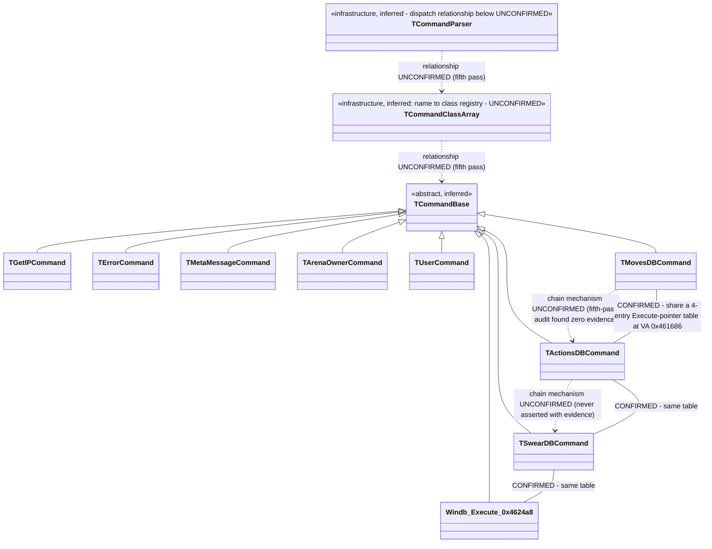
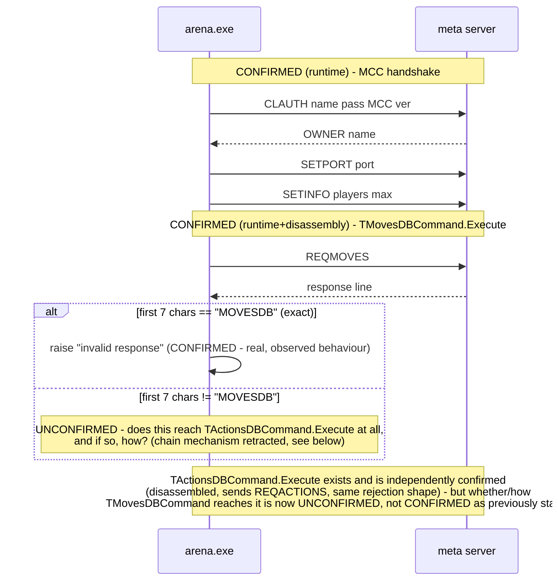

# GITR2K (Get In The Ring 2000) — Protocol Specification
**Living document. Update this file as captures/ fills in with real traffic — never upgrade a confidence level without evidence.**

Confidence levels used throughout this project:
- `CONFIRMED (runtime)` — verified by observing real client/arena traffic (a file under `captures/`).
- `CONFIRMED (disassembly)` — verified directly in the compiled binaries.
- `STRONG INFERENCE` — not proven, but follows tightly from confirmed evidence.
- `UNKNOWN` — genuinely undetermined. Marked explicitly rather than guessed.

---

## 1. Infrastructure (all CONFIRMED by disassembly)

| Fact | Value | Source |
|---|---|---|
| Meta server hostname | `GETINTR2K.MINIDNS.NET` | Default `Host` property, `TIdTCPClient`-family component, both `gitr2k.exe` (`GITRNewsList`) and `arena.exe` (`GMCC`) |
| Meta server port | `9182` | Decoded `Port` property (`0x23DE` LE) in both binaries |
| arena.exe listening port | `7072` | Decoded `Port`/`DefaultPort` properties (`0x1BA0` LE) on `arena.exe`'s `GITRServer` component |
| Registry key | `HKCU\Software\SIPSolutions\GITR2000` | `TRegAuto.RegPath` in both binaries' forms |
| Networking stack | Delphi + Indy (`TIdTCPConnection`/`TIdTCPClient`/`TIdTCPServer`) | Class names visible in compiled RTTI/DFM data |
| Resolver | Standard Winsock `gethostbyname`/`WSAAsyncGetHostByName` | Import table / string analysis — no custom DNS, no hardcoded IP fallback found |

**STRONG INFERENCE:** Windows `HOSTS` file redirection of `GETINTR2K.MINIDNS.NET` should be sufficient to point the client/arena.exe at a replacement server — no binary patching confirmed necessary. This still hasn't been tested directly (our first successful runtime test used a binary-patched client instead, on a machine without admin rights to edit `HOSTS`), so it remains unconfirmed either way.

**CONFIRMED (runtime, 2026-07-23):** Redirecting both the host and port the client/arena.exe connect to (tested via direct binary patch of the DFM-embedded `Host`/`Port` properties, not `HOSTS`) is sufficient for both clients to establish a TCP connection and begin sending real protocol traffic. See `captures/2026-07-23_first_real_capture.txt`.

---

## 2. Known protocol tokens (CONFIRMED to exist in the binaries — semantics mostly UNKNOWN)

The presence of a string in the compiled code confirms the program *recognizes* that token somewhere. It does **not** confirm argument format, delimiters, direction, or expected response — those require a runtime capture.

| Token | Found in | Direction (assumed) | Confidence of token existence | Confidence of everything else |
|---|---|---|---|---|
| `GETNEWS` | gitr2k.exe | client→server | CONFIRMED (disassembly) | UNKNOWN |
| `GITRNEWS` | gitr2k.exe | server→client | CONFIRMED (disassembly) | UNKNOWN |
| `ENDNEWSLIST` | gitr2k.exe | server→client | CONFIRMED (disassembly) | UNKNOWN |
| `GETWELCOMEMSG` / `WELCOMEMSG` | gitr2k.exe | both directions (assumed) | CONFIRMED (disassembly) | UNKNOWN |
| `METAARENALIST` | gitr2k.exe | server→client (assumed) | CONFIRMED (disassembly) — exists exactly once in the binary | UNKNOWN — handler not yet located, see §4 |
| `ENDARENALIST` | gitr2k.exe | server→client (assumed) | CONFIRMED (disassembly) | UNKNOWN |
| `USERENTER` / `USERLEAVE` | gitr2k.exe | server→client (assumed) | CONFIRMED (disassembly) | UNKNOWN |
| `SENDCHAT` / `CHATID` | gitr2k.exe | client→server (assumed) | CONFIRMED (disassembly) | UNKNOWN |
| `BASECHAT` | arena.exe | n/a — used internally as a check value | CONFIRMED (disassembly) — used inside the disassembled `GMCCMetaMessage` handler | UNKNOWN semantics |
| `METAMSG` (note: literal string is `"METAMSG "` with a trailing space) | arena.exe | server→client (assumed) | CONFIRMED (disassembly) — literal constant used in `GMCCMetaMessage` | STRONG INFERENCE that message framing is `METAMSG <space><rest of line>` |
| `CHALLENGE` / `DENYCHALLENGE` | gitr2k.exe | client↔server (assumed) | CONFIRMED (disassembly) | UNKNOWN |
| `FIGHTSTART` / `FIGHTSTOP` | gitr2k.exe | server→client (assumed) | CONFIRMED (disassembly) | UNKNOWN |
| `PINGECHO` | gitr2k.exe | client↔server (assumed keepalive) | CONFIRMED (disassembly) | UNKNOWN exact framing |
| `PING` | arena.exe | client↔server (assumed keepalive) | CONFIRMED (disassembly) | UNKNOWN exact framing |
| `YOURIP` | gitr2k.exe | server→client (assumed) | CONFIRMED (disassembly) | UNKNOWN |
| `SETDIVIDER` | gitr2k.exe | server→client (assumed) | CONFIRMED (disassembly) | **Important**: suggests the field delimiter may be assigned dynamically by the server rather than fixed. Treat the delimiter as UNKNOWN until confirmed either way. |
| `CHATREQ`, `FIGHTREQ`, `GRANTOP`, `KICKUSER`, `SETADMINLIST`, `SETBANLIST`, `SETMAXNUM`, `SETWELCOMEMSG` | arena.exe only | assumed admin/host-side commands | CONFIRMED (disassembly) | UNKNOWN |
| `CLAUTH` | both `gitr2k.exe` and `arena.exe` | client→server | CONFIRMED (runtime) — see §3, it's the envelope wrapping every outbound command, not an arena.exe-only admin verb as previously assumed | CONFIRMED (runtime) for framing/args; response format still UNKNOWN |
| `MCC` | arena.exe | client→server, as the `<COMMAND>` value inside a `CLAUTH` line | CONFIRMED (runtime) — not previously in this table at all | CONFIRMED (runtime, 2026-07-23) — arena.exe's registration/handshake with the meta server (matches the `GMCC` component name found via disassembly); acknowledged by an `OWNER <arena name>\r\n` response, see below |
| `RETRCOUNTRIES` | gitr2k.exe | client→server, sent bare (no `CLAUTH` envelope) | CONFIRMED (runtime) — not previously known | CONFIRMED (runtime) response shape — see §5 |
| `COUNTRY` | gitr2k.exe | server→client, per-country line prefix | CONFIRMED (disassembly) — found in the same string table as `METAARENALIST`/`ENDARENALIST` while investigating `RETRCOUNTRIES` | CONFIRMED (runtime) — needs a trailing arena-count field, see §5 |
| `ARENA` | gitr2k.exe | server→client, per-arena line prefix | CONFIRMED (disassembly), same table as above | STRONG INFERENCE (reused in both `METAARENALIST` and `RETRARENALIST` responses) — exact field set still being validated |
| `ENDCOUNTRYLIST` | gitr2k.exe | server→client, terminates a `RETRCOUNTRIES` response | CONFIRMED (disassembly), same table as above | CONFIRMED (runtime) — see §5 |
| `RETRARENALIST` | gitr2k.exe | client→server, sent bare with a country name argument | CONFIRMED (runtime) — brand new, not previously known at all, not even as a string constant we'd noticed | UNKNOWN — response is an active, disclosed guess, see §5 |
| `BOGUS` | gitr2k.exe | client→server, sent bare | CONFIRMED (runtime) — sent repeatedly, exactly every 40s, while a request sits unanswered | **RESOLVED (2026-07-23):** echoing it back verbatim over 6 consecutive cycles (4+ minutes) had zero effect - same 40s interval, no client behavior change. This is unrelated network-level keepalive noise, not a protocol-semantic message needing acknowledgment. No further action needed on this token. |
| `GETARENA` (literal constant is `"GETARENA "` with a trailing space) | gitr2k.exe | server→client (assumed), per-item line prefix candidate for `RETRARENALIST`'s response | CONFIRMED (disassembly) — found in the same string table as `ARENA`/`COUNTRY`/`ENDCOUNTRYLIST`, missed in the first analysis pass | UNKNOWN — being tested as of experiment #7, see §5 |
| `GRANTED` | arena.exe | UNKNOWN direction/usage | CONFIRMED (disassembly) — found near arena.exe's `GMCC.OnArenaOwner` handler | UNKNOWN — zero findable references anywhere in the binary, possibly dead code |
| `OWNER` | arena.exe | server→client, `MCC` acknowledgment token | CONFIRMED (disassembly) — found near `GMCC.OnArenaOwner`; its trivial getter function is actively referenced (unlike `GRANTED`) | **CONFIRMED (runtime, 2026-07-23)** — `OWNER <arena name>\r\n` sent in response to `MCC` causes arena.exe's activity log to show "connected" / "retrieving moves database" and unblocks three brand-new follow-up commands, see below |
| `SETPORT` | arena.exe | client→server, sent bare immediately after `MCC`/`OWNER` | CONFIRMED (runtime, 2026-07-23) — new token, not previously known | CONFIRMED (runtime) — `SETPORT <port>\r\n`, arena.exe self-reporting its real listening port (observed: `7072`), see §5 |
| `SETINFO` | arena.exe | client→server, sent bare immediately after `SETPORT` | CONFIRMED (runtime, 2026-07-23) — new token, not previously known | CONFIRMED (runtime) for shape — `SETINFO <a> <b>\r\n` (observed `0 15`); STRONG INFERENCE only for field meaning/order (assumed player_count, max_players), see §5 |
| `REQMOVES` | arena.exe | client→server, sent bare immediately after `SETINFO`, no arguments | CONFIRMED (runtime, 2026-07-23) — new token, not previously known | CONFIRMED (runtime+disassembly, 2026-07-23) — response is a single line, and must **not** exactly match the 7-char literal `MOVESDB` or arena.exe raises an "invalid response" exception; what response IS accepted is UNKNOWN, see §4/§5 |
| `MOVESDB` | arena.exe | n/a — a rejection trigger, not a response prefix | CONFIRMED (disassembly, 2026-07-23) — `TMovesDBCommand` class name, found clustered with `REQMOVES` and an "invalid response" error string | CONFIRMED (runtime+disassembly, cross-validated) that sending this exact literal as the response is **wrong** - triggers rejection, corrected after an initial (wrong) reading assumed the opposite. **Corrected (2026-07-23, fifth pass):** an earlier claim that this chains into `REQACTIONS`/`ACTIONSDB` via a specific virtual-dispatch mechanism was RETRACTED - a rigorous cross-reference audit found zero evidence connecting the two. `TMovesDBCommand.Execute` is confirmed to share a 4-entry function-pointer table (VA `0x461686`) with `TActionsDBCommand.Execute`/`TSwearDBCommand.Execute`/a `WINDB` handler, but whether/how any of them actually invoke each other is UNCONFIRMED - see §4 fifth pass |
| `REQACTIONS` / `ACTIONSDB` | arena.exe | client→server / rejection trigger | CONFIRMED (disassembly, 2026-07-23) — `TActionsDBCommand.Execute` (VA `0x461b2c`), found as the 2nd entry of the same 4-entry Execute-pointer table as `TMovesDBCommand.Execute` (VA `0x461686`) - found via raw-data cross-reference, not VMT arithmetic | Not yet observed on the wire. **Corrected (2026-07-23, fifth pass):** whether this is reached from `MOVESDB`'s accept branch is UNCONFIRMED, not established as previously stated - see §4 fifth pass. Same rejection-on-exact-name-match rule as `MOVESDB` applies to its own response independently of that |
| `WINDB` | arena.exe | client→server, formatted 2-argument command | CONFIRMED (disassembly, 2026-07-23, fifth pass) — 4th entry of the same Execute-pointer table (VA `0x4624a8`), previously unknown | CONFIRMED (disassembly): sends `WINDB <Arg1> <Arg2>` via the same SendCommand slot as the other three; does **not** wait for or process any reply (full function body traced, no `ReadLn`-shaped call exists). Whether/when it's invoked is UNCONFIRMED - see §4 fifth pass |

**Correction (2026-07-23):** an earlier pass of this document lumped `MOVESDB` in with `arena.exe`'s Pascal-like scripting keywords (`BEGIN`, `WHILE`, `FUNC`, `SCRIPT`, `PLUGIN`, `ACTIONSDB`, `SWEARDB`) as unrelated to the network protocol. That was **wrong for `MOVESDB` specifically** - disassembly now shows it's the real response-prefix literal for a genuine protocol command class, `TMovesDBCommand`, directly tied to the confirmed-runtime `REQMOVES` token (see §4). The other keywords in that list (`BEGIN`/`WHILE`/`FUNC`/`SCRIPT`/`PLUGIN`/`ACTIONSDB`) remain believed unrelated - they belong to an embedded scripting/plugin engine - but this should be treated as unconfirmed rather than dismissed outright, given this correction. `SWEARDB` (with request token `REQSWLIST`) turns out to be a near-identical sibling command class to `TMovesDBCommand`, likely a swear-word/chat-filter list - also a real protocol command, not a scripting keyword.

---

## 3. Login / authentication

**CONFIRMED (runtime, 2026-07-23)** — see `captures/2026-07-23_first_real_capture.txt`. Every outbound command from both clients is wrapped in a single-line envelope:

```
CLAUTH <username> <password> <COMMAND> <version>\r\n
```

- Fields are space-delimited (confirmed: exactly 4 spaces in every captured line, 5 fields total including `CLAUTH` itself), line-terminated with `\r\n`.
- This is sent **immediately on connect, before any other handshake** — answers open question #1 from §6. There is no separate login/handshake step before commands become meaningful; `CLAUTH` *is* the envelope, sent per-command, not once per session.
- Observed `<username>`/`<password>` values so far:
  - `gitr2k.exe` requesting `GITRNEWS` on startup: `NIL NIL` (both literal string `"NIL"`)
  - `gitr2k.exe` requesting `METAARENALIST` (from the arena-select dialog): empty-string username, literal `"NIL"` password — i.e. these two fields are **not** filled in consistently from one command to the next by the same unauthenticated session. Worth resolving once we've captured a command sent *after* an actual login.
  - `arena.exe` requesting `MCC`: username `"Test"` (the literal arena name typed into its GUI), password `"none"` (literal word, distinct from `gitr2k.exe`'s `"NIL"` placeholder)
- `<version>` was `0` in all three captures so far — UNKNOWN whether this is a fixed protocol version or something else entirely.
- Still **UNKNOWN**: what a real login (`Login as a Guest User` / `Register a Username` / `Login with current Username`) actually sends — none of our captures so far came from clicking those options.

**CONFIRMED (runtime, 2026-07-23, second session):** the `CLAUTH` envelope only wraps the *first* message sent on a connection — subsequent commands on the same already-open connection are sent bare, with no envelope at all. Observed directly: after receiving a response to `METAARENALIST`, `gitr2k.exe` sent a bare `RETRCOUNTRIES\r\n` on that same connection (see `captures/2026-07-23_first_real_capture.txt`, second session).

`RETRCOUNTRIES` is a previously-unknown token, discovered only because the real client sent it. Investigating it turned up `COUNTRY`, `ARENA`, and `ENDCOUNTRYLIST` as compiled string constants in `gitr2k.exe`, sitting in the *same* string-constant table as `METAARENALIST`/`ENDARENALIST` — real anchors we didn't know to look for before this. This is what the "Select Arena" dialog's "retrieving country list" status text is actually waiting on; the `METAARENALIST` response alone didn't satisfy it. See `commands/retrcountries.py` for the follow-up experimental response (untested as of this writing).

**CONFIRMED (runtime, 2026-07-23) - the real arena-discovery flow is a three-stage lazy hierarchy**, established by iterating the `RETRCOUNTRIES` response until the client accepted it, then observing what it did next:

1. `METAARENALIST` → still-unconfirmed ack/stub response
2. `RETRCOUNTRIES` → `COUNTRY <name> <arena_count>\r\n` per country, then `ENDCOUNTRYLIST\r\n` — **this exact shape is confirmed working**: the "Select Arena" tree populates cleanly (verified with an "International" node showing count 1)
3. `RETRARENALIST <country>` → sent automatically by the client once (2) succeeds, requesting that one country's actual arena details. A brand-new command, not previously known at all. Response is an active, disclosed guess (see `commands/retrarenalist.py`) reusing the already-known `ARENA`/`ENDARENALIST` tokens.

Also observed: `BOGUS\r\n`, sent bare ~38 seconds after a `RETRARENALIST` request got no response. **RESOLVED (2026-07-23):** confirmed via 6 observed cycles over 4+ minutes to repeat exactly every 40 seconds regardless of server response; echoing it back had zero effect. Concluded to be unrelated network-level keepalive noise, not a protocol-semantic message.

**CONFIRMED (runtime, 2026-07-23) — the `MCC` (arena registration) handshake is now unblocked.** After `RETRARENALIST` guessing stalled (7 attempts, all rejected/inconclusive), work shifted to arena.exe's registration flow instead, which had been stuck the entire time: its "Start" button stayed permanently disabled and its activity log stayed empty across every prior test, with no response ever sent to `MCC`. Sending `OWNER <arena name>\r\n` (e.g. `OWNER Test\r\n`) in response to `MCC` produced an immediate, real client reaction:

- arena.exe's activity log showed **"connected"** and then **"retrieving moves database"**
- three brand-new bare commands appeared on the same connection, in order: `SETPORT 7072\r\n`, then `SETINFO 0 15\r\n`, then `REQMOVES\r\n`

This confirms `OWNER <arena name>\r\n` is the correct (or at least sufficient) `MCC` acknowledgment. `SETPORT`/`SETINFO` are arena.exe self-reporting its real listening port and stats back to the meta server — both are now parsed and recorded into `ArenaRegistry` (see `commands/setport.py`, `commands/setinfo.py`, `server/registry.py`). `REQMOVES` matches the "retrieving moves database" status text but its response format is completely unknown; the server currently only observes/logs it (see `commands/reqmoves.py`) rather than guessing blind, per this project's isolate-one-variable methodology.

Since `SETPORT`/`SETINFO`/`REQMOVES` are all sent bare with no arena name repeated, they're correlated back to the arena that registered via `MCC` earlier on the same connection through the per-connection `context` dict (`context["arena_name"]`, set once by `commands/mcc.py` and read by the later handlers).

**Bug found and fixed (2026-07-23, same session):** the real capture showed `SETINFO 0 15\r\n` and `REQMOVES\r\n` arriving **coalesced in a single TCP `recv()`** (`SETINFO 0 15\r\nREQMOVES\r\n`, one packet). The server's connection handler previously passed each raw `recv()` chunk straight to the dispatcher unsplit, and the dispatcher only inspects the *first* token of whatever bytes it's given - so `REQMOVES` was silently dropped: never dispatched, never logged as `COMMAND_SEEN`. Fixed in `server/connection.py` by buffering incoming bytes and splitting on line boundaries (`\n`) before dispatching each line separately, so every command gets its own `dispatch()` call regardless of how the client batches them on the wire. This means arena.exe (and possibly gitr2k.exe) can and does coalesce multiple commands into one TCP segment - worth remembering for any future capture where a command "goes missing" from the log.

---

## 4. Dispatcher / handler functions located via disassembly

Using Delphi's compiled **published-method RTTI table** (maps component event properties to real function addresses — a reliable technique, not string-guessing):

| Event | Method | Address (arena.exe) | Status |
|---|---|---|---|
| `GMCC.OnMetaMessage` | `GMCCMetaMessage` | `0x0049F80C` | CONFIRMED (disassembly) — full body disassembled, see below |
| `GMCC.OnArenaOwner` | `GMCCArenaOwner` | `0x0049F8F0` | CONFIRMED (disassembly) — body analyzed (2026-07-23): a tiny event-relay stub (~20 bytes, forwards to a generic dispatch helper at `0x403188` with a constant `0xFFED`), not directly informative about wire format. But the nearby string-constant table led to `GRANTED`/`OWNER` (see §2, §5) - `OWNER` is now CONFIRMED (runtime) as the `MCC` acknowledgment. |
| `GMCC.OnDisconnected` | `GMCCDisconnected` | not yet extracted | UNKNOWN address |
| `GMCC.OnError` | `GMCCError` | not yet extracted | UNKNOWN address |

### `GMCCMetaMessage` (0x49F80C–0x49F890) — CONFIRMED disassembly summary

```
if Pos('BASECHAT', Self.field_at_0x2D4) <> 0 then
    ; calls an internal routine twice with the literal string "METAMSG "
    ; (8 bytes, includes trailing space) as one operand, then calls
    ; another internal routine using Self.field_at_0x300
    ; -> STRONG INFERENCE: this appends/displays a "METAMSG <text>"
    ;    formatted chat line
else
    ; falls through to cleanup, does nothing
```

This function does **not** reference `METAARENALIST` anywhere in its body — that command's handler is still UNKNOWN / not located. It's either in a different branch of a larger dispatcher not yet mapped, or reached through a different event entirely.

Internal helper addresses referenced but not identified: `0x45A36C` (calling convention matches `System.Pos`), `0x403FA0` (called twice with `"METAMSG "` — purpose unconfirmed), `0x462FA0` (purpose unconfirmed). These would be worth revisiting once real `METAMSG` traffic is captured, since we'll then have ground truth to check candidate interpretations against.

### `TMovesDBCommand` (arena.exe VA `0x461d34`–`0x461e92`) — CONFIRMED disassembly summary

Located (2026-07-23) via exhaustive raw-bytes cross-reference search for the compiled `"REQMOVES"` (VA `0x461ef4`) and `"MOVESDB"` (VA `0x461f14`) string constants - each has exactly one reference in the whole binary, both inside this single method. A near-identical sibling method exists nearby (VA `0x461f38`–`0x462096`) referencing `"REQSWLIST"`/`"SWEARDB"` instead - same shape, different literals, confirming a small family of "request a named database" command classes rather than a one-off.

```
procedure TMovesDBCommand.Execute(Self, P2: <unknown>);
begin
  Self.SomeMethod();                          ; VMT+0x84 call below actually sends the command
  list_obj := SomeGlobal.Create(...);          ; VA 0x461728, via helper 0x402f7c

  Self.SendCommand("REQMOVES");                ; virtual call, VMT+0x84 - matches confirmed wire traffic
  received_line := Self.ReadLn(Terminator:="\r\n", MaxLen:=-2);  ; virtual call, VMT+0x74 - ONE line only, no loop
  prefix7 := Copy(received_line, 1, 7);         ; System.Copy via helper 0x40415c

  if prefix7 = "MOVESDB" then                   ; helper 0x404064 is Delphi's _LStrCmp (exact AnsiString equality)
      raise EInvalidResponse.Create("invalid response")   ; string at VA 0x461f24
  else
      Self.field_0xC4.SomeParseMethod(received_line);      ; virtual call, VMT+0x9c - full line, not just remainder
end;
```

Key findings, all CONFIRMED (disassembly) after a correction:

- The response to `REQMOVES` is read with a **single** `ReadLn`-shaped call - no loop back for further lines, unlike the multi-line-plus-terminator shape used by `RETRCOUNTRIES`/`RETRARENALIST`/`METAARENALIST`. STRONG INFERENCE: the response is exactly one line.
- **Correction (2026-07-23, same session):** the first pass of this analysis misread the branch direction and concluded the response *must* start with `"MOVESDB"`. That was backwards. The comparison helper at VA `0x404064` was re-examined and identified as Delphi's `_LStrCmp` - a byte-for-byte AnsiString equality check whose final `add eax,eax` on the length-difference is the standard Delphi codegen trick for making `ZF=1` mean "fully equal" (same length **and** same content). The caller's `je` fires straight off that call (no intervening `test`), and the jump target is the **exception-raising** block, not the success path. So an **exact match** to the 7-character literal `"MOVESDB"` triggers `raise "invalid response"` - the opposite of what was first assumed.
- This correction was cross-validated against real client behavior: `commands/reqmoves.py`'s first experiment sent a bare `MOVESDB\r\n` (informed by the original, wrong reading), and arena.exe's activity log showed exactly the predicted-by-the-corrected-reading outcome: `"Could not connect to main GITR server, message follows: Exception: invalid response"`. The static analysis and the runtime reaction now agree.
- If the prefix does **not** exactly match `"MOVESDB"`, the **entire line** (not just a remainder) is handed to a further virtual method (`VMT+0x9c`).

### VMT reconstruction (2026-07-23, second pass) - ⚠️ RETRACTED, see fourth-pass correction below

**This subsection's central claim was WRONG and is retracted** - kept here (rather than deleted) so the record shows the mistake rather than hiding it. The original text claimed `VMT+0x9c` for `TMovesDBCommand` resolved to `0x461a20`, and that disassembling `0x461a20` revealed a chained `TActionsDBCommand`-shaped handler. A later pass (fourth pass, same day) directly dumped the raw bytes at `0x461a20` and found it is **not code at all** - it's data: a run of pointers immediately followed by the length-prefixed string `"TSwearDBCommand"`. The earlier disassembly of that address was decoding garbage bytes that happened to re-synchronize into real code only once the byte stream reached `0x461b2c` (the true, cleanly-prologued `TActionsDBCommand.Execute`) - and that coincidental landing was mistaken for a working virtual dispatch. The "VMT base = `0x461938`" reconstruction this was built on is unreliable for the same reason (reading past a few legitimate-looking slots runs straight into embedded per-class name-string data, not a real Delphi VMT layout).

**What remains true from this pass:** `REQMOVES`/`MOVESDB`'s rejection rule (exact match to the 7-char literal triggers `"invalid response"`) is unaffected - that was established from `TMovesDBCommand.Execute`'s own body (`0x461d34`, a real, cleanly-disassembled function) and cross-validated against the real client's reaction, neither of which depended on the retracted VMT claim. **What's now unconfirmed:** the specific mechanism by which `TMovesDBCommand` reaches `TActionsDBCommand` (if it does at all) - see the fourth-pass correction below for what's actually solid.

### Subsystem architecture (2026-07-23, third pass) - the full command-class family

Before tracing `Self+0xC4` further, stepped back to map the whole subsystem `TMovesDBCommand` belongs to, using a full-binary scan for Pascal shortstring class names (`T<Name>`) rather than chasing one function at a time.

**Class list - CONFIRMED (string-table evidence).** Found the entire family in one contiguous block of the compiled string table, three infrastructure names followed by eight concrete command classes, with strikingly regular spacing between adjacent entries (112-116 bytes each) - strong evidence these are literal entries in a single class-registration array, not coincidental placement:

```
TCommandBase            <- infrastructure (base class, believed abstract)
TCommandClassArray      <- infrastructure (name -> class registry, believed)
TCommandParser          <- infrastructure (dispatcher, believed)

TGetIPCommand           <- concrete command
TErrorCommand           <- concrete command
TMetaMessageCommand     <- concrete command
TArenaOwnerCommand      <- concrete command
TUserCommand            <- concrete command
TMovesDBCommand         <- concrete command  (already known)
TActionsDBCommand       <- concrete command  (already known; shares an Execute-pointer table with
                                               Moves - see §4 fifth pass; chain relationship to Moves
                                               is UNCONFIRMED, corrected from an earlier wrong claim)
TSwearDBCommand         <- concrete command  (already known; same table, same caveat)
```

**Mapping classes to known protocol tokens - STRONG INFERENCE from naming, cross-checked against independent earlier findings where possible:**

| Class | Believed token(s) | Basis |
|---|---|---|
| `TGetIPCommand` | `YOURIP` | Name match; `YOURIP` already CONFIRMED (disassembly) elsewhere in this doc |
| `TErrorCommand` | generic error path | Name match; likely what emits the `"an error has occured."` string seen throughout live testing |
| `TMetaMessageCommand` | `METAMSG` / `BASECHAT` | Name match to the already-disassembled `GMCCMetaMessage` handler (§4 above) |
| `TArenaOwnerCommand` | `OWNER` / `GRANTED` | Name match to the already-disassembled `GMCCArenaOwner` handler (§4 above) - this is the class behind the CONFIRMED-working MCC ack |
| `TUserCommand` | `USERENTER` / `USERLEAVE` | Name match only, not independently cross-checked |
| `TMovesDBCommand` | `REQMOVES` / `MOVESDB` | CONFIRMED (disassembly + runtime), this section |
| `TActionsDBCommand` | `REQACTIONS` / `ACTIONSDB` | CONFIRMED (disassembly) as a real function sharing an Execute-pointer table with Moves (§4 fifth pass). **Corrected:** "chained directly from Moves's accept branch" was RETRACTED - no evidence found for this on re-audit |
| `TSwearDBCommand` | `REQSWLIST` / `SWEARDB` | CONFIRMED (disassembly) as a real function in the same Execute-pointer table (§4 fifth pass) - chain relationship to Moves/Actions UNCONFIRMED, same correction as above |
| (new) `Windb.Execute` | `WINDB` | CONFIRMED (disassembly, fifth pass) as the table's 4th entry - see §4 fifth pass for the full reversal |

**Inheritance tree - STRONG INFERENCE for class membership; the factory/dispatch relationship below is RETRACTED, see fifth pass.** All eight concrete classes are believed direct descendants of `TCommandBase` (not a narrower intermediate "database command" base) - no separate `TDBCommand`/`TDatabaseCommand`-style name was found anywhere in the string table between `TUserCommand` and `TMovesDBCommand`, or anywhere else. This subsection originally also claimed `TCommandParser`+`TCommandClassArray` form a name-keyed factory/dispatch pair that constructs/invokes the concrete command classes. **Corrected (2026-07-23, fifth pass):** `TCommandParser`'s own descriptor record was directly checked and contains no reference to the Execute-pointer table (§4 fifth pass, objective 3) - the dispatch relationship shown below is UNCONFIRMED, not established fact.



**Shared virtual methods - RETRACTED, superseded by the fifth pass below.** This subsection originally claimed the VMT-slot-comparison technique "worked cleanly" for `TMovesDBCommand`/`TMetaMessageCommand`/`TArenaOwnerCommand`/`TUserCommand`/`TGetIPCommand` and only failed for `TActionsDBCommand`/`TSwearDBCommand`. The fifth-pass audit below shows the underlying technique itself was unsound for all of them (the "VMT" being read was actually per-class descriptor-record data, not a true Delphi VMT, and reading into it far enough hits embedded string data even for the classes that looked "clean"). No claim is made here about which methods are shared vs overridden - see the fifth pass for what's actually confirmed instead (the Execute-pointer array, found via a sound technique).

**Does `Self+0xC4` point to one common database object? UNKNOWN - trace attempted, inconclusive, paused on operator instruction.** See the fourth-pass correction immediately below for what was found and why it wasn't conclusive.

**Sequence diagram - what's CONFIRMED vs UNCONFIRMED, from `MCC` onward:**



### Correction (2026-07-23, fourth pass) - the VMT+0x9c chain claim was wrong; here's what's actually solid

Attempting to trace `Self+0xC4` (per operator instruction, after the architecture review above) surfaced a genuine methodology failure worth recording in detail, since it corrects claims already committed to this document.

**What's solid (found via a more reliable technique - searching for a known, independently-confirmed address as raw data, rather than guessing offsets):**

Searched the whole binary for the literal 4-byte value `0x461d34` (`TMovesDBCommand.Execute`'s confirmed address) appearing as data. Found exactly one hit, at VA `0x461686`. Reading four consecutive dwords starting there gives a clean, unambiguous array:

```
VA 0x461686: 0x461d34   TMovesDBCommand.Execute    (REQMOVES/MOVESDB)
VA 0x46168a: 0x461b2c   TActionsDBCommand.Execute  (REQACTIONS/ACTIONSDB)
VA 0x46168e: 0x461f38   TSwearDBCommand.Execute    (REQSWLIST/SWEARDB)
VA 0x461692: 0x4624a8   (new) a 4th Execute - sends "WINDB " (trailing space,
                         same compiled-constant pattern as METAMSG) - not
                         previously known, likely a match-result/stats report
```

All four addresses were independently disassembled and are real, clean functions (proper `push ebp / mov ebp,esp` prologues). This is now the most solid finding in this whole investigation thread: there is a genuine 4-entry table of `Execute` entry points for this family, immediately followed in memory by the `"TGITRClient"` string (this app's own network-client wrapper class, confirmed to exist via the class-name scan in the subsystem-architecture pass above).

**What's retracted:** the claim that `TMovesDBCommand.Execute`'s internal `call [ebx+0x9c]` (where `ebx` = `TMovesDBCommand`'s own dereferenced Self-pointer) resolves to `0x461a20`, and that this represents "the Actions chain". Directly dumping raw bytes at `0x461a20` shows it is **data** (a pointer run immediately followed by the `"TSwearDBCommand"` string), not code - the earlier "successful" disassembly of that region was reading through this data and coincidentally re-synchronizing into real code at `0x461b2c` (`TActionsDBCommand.Execute`, found completely independently via the array above). The two facts got conflated. **The true value actually stored at `TMovesDBCommand`'s real `Self+0` → VMT/descriptor → `+0x9c` slot has not been reliably determined** - the "VMT base = `0x461938`" computation it depended on is itself suspect, since reading forward from it runs into the same kind of embedded string data rather than a clean, extended method table.

**Reframed understanding:** this `TCommandBase` family likely does not use a textbook Delphi VMT for dispatch at all - the ~112-byte, per-class blocks found during the subsystem-architecture pass (mixing a few pointers with an inline class-name string) look like a **hand-rolled per-class descriptor record**, not RTTI's standard negative-offset/VMT layout. That would explain every inconsistency hit while brute-forcing offsets: real Delphi VMTs don't interleave string data into the method-pointer region the way these do.

**Attempt to trace `Self+0xC4`'s object, and why it's inconclusive:** searched for the byte pattern `mov [reg+0xC4], reg` (opcode `89` with a disp32 ModRM) across the whole binary and found a small, tightly-clustered group of functions (`0x45f3ba`-`0x45f5f0`) that construct, destroy, and lazily populate an object at instance-offset `0xC4` - storing two callback-shaped values (copied from `Self`'s own `+0x9c`/`+0xA0`) into the new object, plus several back-references to `Self`. This is a plausible "pending reply / async continuation" pattern. However, **this cluster could not be confirmed to belong to `TMovesDBCommand`'s own hierarchy** - checking whether `TMovesDBCommand`'s (unreliable) "VMT" referenced any of these addresses came back empty, which is inconclusive rather than a real negative result, given the VMT computation itself is now in doubt. File-position proximity puts this cluster right next to Indy's own `TIdConnectThread`/`TIdPollThread` classes and just before `TGITRClient`'s name string, so it may belong to `TGITRClient` (the shared base network-client wrapper) rather than to the `TCommandBase` command hierarchy specifically - genuinely unresolved.

**Status: paused here on operator instruction** (2026-07-23) given the demonstrated unreliability of further manual VMT-style reconstruction without Delphi-RTTI-aware tooling (IDR, or IDA/Ghidra with a Delphi plugin) or a live debugger, neither available in this environment. The solid Execute-pointer-array finding stands; the `Self+0xC4` object's exact class, its own fields, and whether it's shared or per-instance remain open questions for a future pass with better tooling.

### Fifth pass (2026-07-23) - exhaustive cross-reference audit (no VMT arithmetic), WINDB fully reversed, dispatcher search

Per operator instruction: prioritize independently-verifiable evidence over further reconstruction, treat the table at `0x461686` as the anchor (not any reconstructed VMT), and explicitly avoid brute-forcing offsets or inferring class relationships from arithmetic. Everything below uses only raw byte/pointer cross-referencing and direct disassembly.

**Objective 1 - cross-reference audit of the table at `0x461686`.** Searched exhaustively for every way code in this binary could reference the table or its four entries: raw absolute-pointer occurrences (any 4-byte literal, any alignment, anywhere in the file), direct `CALL rel32`/`JMP rel32` instructions targeting each address, and SIB-indexed addressing using `0x461686` as a literal base (the classic `call [reg*4+0x461686]` computed-jump-table shape). Also checked whether anything *writes* to the table's slot addresses (a runtime-registration pattern).

| Address | Raw pointer refs outside the table | Direct `CALL`/`JMP` refs | Indexed/SIB refs with this literal base | Written-to anywhere |
|---|---|---|---|---|
| `0x461686` (table base) | none | none | none | none |
| `0x461d34` (Moves.Execute) | none (only the table's own slot 0) | none | none | none |
| `0x461b2c` (Actions.Execute) | none (only the table's own slot 1) | none | none | none |
| `0x461f38` (Swear.Execute) | none (only the table's own slot 2) | none | none | none |
| `0x4624a8` (Windb.Execute) | none (only the table's own slot 3) | none | none | none |

**CONFIRMED (exhaustive byte-level search) - a clean negative:** nothing else anywhere in this binary holds a static reference to the table or to any of its four entries. No constructor, no registration routine, no loop, and no direct call site exists for any of them.

- **Static or dynamically registered?** The four pointers are compiled directly into the file at a fixed offset - not written by any runtime code (confirmed: nothing writes to these addresses either). The table's *contents* are static compiled data. Whether it's genuinely "iterated as a table" by something, versus being four unrelated classes' method-table slots that merely land at the same relative position in memory, is **UNCONFIRMED** either way - both are consistent with the evidence, and choosing between them would require VMT/RTTI-aware tooling this pass deliberately avoids.
- **Who iterates it? Linear or conditional?** No evidence of iteration (no loop construct references this address range) and no evidence of any code path connecting the four entries in either direction. **This corrects the framing of the second-pass VMT-reconstruction claim and the third-pass architecture diagram**, both of which asserted a chain relationship (`Moves -> Actions -> Swear`) that this more rigorous audit found zero supporting evidence for. That chain relationship is now UNCONFIRMED, not merely "unreliable" - it should be treated as an open question, not a downgraded-but-still-likely fact.

**Objective 2 - WINDB (`0x4624a8`) fully reversed.** Full disassembly, `0x4624a8` to its `ret` at `0x46251f` (reproduced in full below - this is the entire function body, nothing omitted):

```
4624a8: push ebp / mov ebp,esp / sub esp,0xc / push ebx / push esi
4624b2: [ebp-0xc] := 0                      ; destination buffer for the built string, zeroed
4624b5: [ebp-0x8] := ecx                    ; Arg2 (2nd explicit method parameter)
4624b8: [ebp-0x4] := edx                    ; Arg1 (1st explicit method parameter)
4624bb: esi := eax                          ; Self
4624bd: call 0x404108 on [ebp-0x4]          ; string-management helper (ref-count/prep), called on Arg1
4624c5: call 0x404108 on [ebp-0x8]          ; same helper, called on Arg2
4624cd: (SEH frame setup)
4624db: push "WINDB "  (VA 0x462538, 6 bytes incl. trailing space)
4624e0: push [ebp-0x4]                       ; Arg1
4624e3: push " "        (VA 0x462548, 1 byte)
4624e8: push [ebp-0x8]                       ; Arg2
4624eb: lea eax,[ebp-0xc] / mov edx,4 / call 0x404014   ; 4-argument string concatenation (System._LStrCatN)
4624f8: edx := [ebp-0xc]                     ; the built string
4624fb: eax := esi (Self) / ecx := [eax] / call [ecx+0x84]   ; SendCommand-shaped virtual call - same slot used to send REQMOVES/REQACTIONS/REQSWLIST
462505: (SEH cleanup)
462512: lea eax,[ebp-0xc] / mov edx,3 / call 0x403cf8   ; finalize/free the temporary concatenated string
46251f: ret
```

Traced `0x404014` directly (rather than assuming argument order) - it is Delphi's `System._LStrCatN` (concatenate N strings), confirmed by disassembling its body: it reads the pushed arguments back in the **same order they were pushed** (first-pushed processed first, appended first into the result buffer), both in its length-summing pass and its copy pass. Given the push order above (`"WINDB "`, Arg1, `" "`, Arg2), the resulting command string is:

```
"WINDB " + Arg1 + " " + Arg2
```

i.e. `WINDB <Arg1> <Arg2>` - a plain space-delimited two-argument command, consistent with the naming convention used everywhere else in this protocol (`OWNER <name>`, `COUNTRY <name> <count>`, etc.), sent via the same `+0x84` "SendCommand" virtual slot the three DB-chain handlers also use.

Answers to the specific questions asked:

| Question | Answer | Confidence |
|---|---|---|
| Exact strings referenced | `"WINDB "` (6 bytes, VA `0x462538`, trailing space baked in - same compiled-constant pattern as `METAMSG `) and `" "` (1 byte, VA `0x462548`) | CONFIRMED (disassembly) |
| Exact command sent | `WINDB <Arg1> <Arg2>\r\n` (the `\r\n` is presumed added by the shared `SendCommand` method, as with the other three handlers - not visible in this function itself) | CONFIRMED (disassembly) for the `WINDB <Arg1> <Arg2>` part; the `\r\n` termination is STRONG INFERENCE by analogy, not directly seen in this function |
| Argument formatting | `Arg1` = the method's first explicit parameter (`edx` at entry), `Arg2` = second (`ecx` at entry); concatenated in that order with a literal space between them, no other formatting/padding | CONFIRMED (disassembly, via tracing `_LStrCatN`'s actual argument-processing order) |
| Response handling | **None.** No `ReadLn`-shaped call, no comparison logic, nothing resembling response processing exists anywhere in this function | CONFIRMED (disassembly - the full function body is reproduced above, nothing omitted) |
| Does it wait for a reply? | **No.** The function sends and returns immediately (SEH cleanup, then `ret`) | CONFIRMED (disassembly) |
| Does it participate in startup? | **UNKNOWN.** Per objective 1's audit, this function (like the other three) has zero static references anywhere - there is no evidence either way for when or whether it's invoked during startup | UNKNOWN - explicitly not guessed |

**Objective 3 - locating the dispatcher.** Per operator instruction, VMT reconstruction was avoided entirely; searched instead from references to the table, constructor references, registration routines, and loop constructs (all covered by objective 1's exhaustive search above) - **no dispatcher was found**. `TCommandParser`'s own class-name string was cross-referenced the same reliable way used for the DB-chain classes (search for its compiled shortstring's address as raw data) - it has exactly one external reference, at VA `0x457fa8`, which sits inside a data block of function pointers (`0x4010b0`, `0x4031d0`-`0x4031e4`, `0x402f40`, `0x402f54`, `0x458354`, `0x458520`, `0x458300`, `0x45838c`, `0x4584b8`) - **none of which equal the table base or any of its four entries**. So `TCommandParser`'s own descriptor record does not reference this table either, by direct check (not offset inference). **Conclusion: the real startup dispatcher that invokes these four `Execute` functions was not located by any of the permitted techniques.** This should be recorded as a genuine unknown, not inferred to be "definitely a VMT" or "definitely something else" - both remain equally unproven.

**Objective 4 - startup state machine, confirmed evidence only:**

```mermaid
stateDiagram-v2
    [*] --> MCC_sent : CONFIRMED (runtime)
    MCC_sent --> OWNER_received : CONFIRMED (runtime) - server sends OWNER name
    OWNER_received --> SETPORT_sent : CONFIRMED (runtime) - non-blocking, arena.exe does not wait for a server reply
    SETPORT_sent --> SETINFO_sent : CONFIRMED (runtime) - non-blocking, sometimes coalesced with SETPORT in one TCP segment
    SETINFO_sent --> REQMOVES_sent : CONFIRMED (runtime) - non-blocking, sometimes coalesced with REQMOVES in one TCP segment
    REQMOVES_sent --> AwaitingResponse : CONFIRMED (disassembly) - TMovesDBCommand.Execute performs exactly one blocking ReadLn call right after sending
    AwaitingResponse --> InvalidResponseRaised : CONFIRMED (runtime+disassembly) - if response's first 7 chars exactly equal "MOVESDB"
    AwaitingResponse --> Unknown : UNCONFIRMED - what response IS accepted, and what happens next, is not established by any current evidence
    InvalidResponseRaised --> [*] : CONFIRMED (runtime, observed) - arena.exe shows an explicit error dialog/log line; no further activity observed in that test session
    Unknown --> [*]
```



| Stage | Command sent | Expected response | Blocking? | Next transition | Confidence |
|---|---|---|---|---|---|
| Registration | `CLAUTH <name> <pass> MCC <ver>` | `OWNER <name>` | Blocking (arena.exe's subsequent messages never precede receiving this) | → `SETPORT` | CONFIRMED (runtime) |
| Port report | `SETPORT <port>` | none | Non-blocking (observed coalesced with the next message in one TCP segment) | → `SETINFO` | CONFIRMED (runtime) |
| Stats report | `SETINFO <a> <b>` | none | Non-blocking (observed coalesced with the next message) | → `REQMOVES` | CONFIRMED (runtime) |
| Moves DB request | `REQMOVES` | one line | **Blocking** - a single `ReadLn` call executes immediately after sending, in the same function | → reject or `?` | CONFIRMED (disassembly) for the blocking `ReadLn`; CONFIRMED (runtime) for the request itself |
| Moves DB response check | *(server's response line)* | must not exactly equal `"MOVESDB"` | N/A | → `InvalidResponseRaised` if equal; → `?` (unknown) if not | CONFIRMED (disassembly + runtime cross-validated) for the rejection rule |
| ??? (accept path) | unknown | unknown | unknown | unknown | **UNCONFIRMED** - no evidence connects this to `REQACTIONS`, `WINDB`, or any other specific stage |
| ??? (post-reject behavior) | none observed | N/A | N/A | arena.exe's UI shows the error and stalls; whether it retries REQMOVES itself has not been tested for a long enough window to confirm or rule out | UNKNOWN |
| While `REQMOVES` sits unanswered | none - client-side only | N/A | N/A | `BOGUS` fires periodically (~38-40s), same as previously observed for an unanswered `RETRARENALIST` | **CONFIRMED (runtime, 2026-07-23):** generalizes the earlier `BOGUS`-is-generic-keepalive conclusion - it fires for any unanswered request, not one specific to arena discovery |

**Objective 5 - audit of prior claims.** See the corrections applied throughout §2, §4 (subsystem architecture), and §5 of this document (each edit marked in place, not silently changed) - every statement that asserted a `Moves -> Actions` (or further) chain, or attributed a finding to "VMT reconstruction", has been corrected to either cite the (solid) Execute-array finding instead, or marked UNCONFIRMED where no independent evidence survives this pass.

**Dead end found (2026-07-23):** traced the `"METAARENALIST"` string constant (in gitr2k.exe) to a tiny function at `0x54D01C` that does nothing but return that literal (classic Delphi codegen for `Result := 'METAARENALIST'` — almost certainly a command-name getter on one class in a family of protocol-message classes). Static cross-reference analysis (radare2, full `aaa` auto-analysis, 5353 functions found) turned up **zero callers** of that function. This strongly suggests it's invoked through a Delphi virtual-method-table slot (polymorphic dispatch) rather than a direct call instruction — tracing that needs Delphi-VMT/RTTI-aware tooling (e.g. IDA with Delphi analysis, or "Interactive Delphi Reconstructor") that wasn't available for this pass. Static disassembly is stalled here for now; see §5/§6 for the empirical approach taken instead.

---

## 5. Recovered protocol — command table

*(To be filled in as `captures/` gets real data. Structure ready; nothing here should be invented ahead of evidence.)*

| Command | Direction | Args | Delimiter | Example packet | Meaning | Expected response | Confidence |
|---|---|---|---|---|---|---|---|
| `GITRNEWS` | client→server | username, password | space, `\r\n` terminated | `CLAUTH NIL NIL GITRNEWS 0\r\n` | gitr2k.exe requesting the news bulletin on startup | UNKNOWN (see `GITRNEWS`/`ENDNEWSLIST` tokens in §2) | CONFIRMED (runtime) for the request; response UNKNOWN |
| `METAARENALIST` | client→server | username, password | space, `\r\n` terminated | `CLAUTH  NIL METAARENALIST 0\r\n` | gitr2k.exe requesting the arena list for the "Select Arena" dialog | **ACTIVE EXPERIMENT (2026-07-23, unconfirmed):** server now replies `METAARENALIST <name> <player_count> <max_players>\r\n` per registered arena, then bare `ENDARENALIST\r\n`. Guessed by symmetry with `GETNEWS`/`GITRNEWS`/`ENDNEWSLIST`, not derived from disassembly (see the dead-end note in §4). Awaiting real client reaction as validation - does the arena-select dialog actually populate? | CONFIRMED (runtime) for the request; response is a disclosed guess, not confirmed |
| `MCC` | client→server | arena name, arena password | space, `\r\n` terminated | `CLAUTH Test none MCC 0\r\n` | arena.exe registering itself with the meta server | **CONFIRMED (runtime, 2026-07-23):** `OWNER <arena name>\r\n`, e.g. `OWNER Test\r\n` - informed by the `GMCC.OnArenaOwner` event and the `OWNER` string constant found near it (see §2, §4). Real client reaction observed: activity log shows "connected" / "retrieving moves database", and arena.exe sends `SETPORT`/`SETINFO`/`REQMOVES` in response (see rows below). GRANTED was never needed since this worked on the first attempt. | **CONFIRMED (runtime)** |
| `RETRCOUNTRIES` | client→server | *(none - sent bare)* | `\r\n` terminated, no envelope | `RETRCOUNTRIES\r\n` | gitr2k.exe requesting the country list for the "Select Arena" tree, sent on the same connection right after a `METAARENALIST` response | **CONFIRMED (runtime, 2026-07-23):** `COUNTRY <name> <arena_count>\r\n` per country, then bare `ENDCOUNTRYLIST\r\n`. The "Select Arena" tree populates cleanly (verified: an "International" node showing count 1, no error) - the first fully client-validated response format in this project. Getting here took 3 rejected/isolating attempts (see git history for `commands/retrcountries.py`): omitting the trailing count field, or including any `ARENA` sub-lines, both produced "an error has occured." | **CONFIRMED (runtime)** |
| `RETRARENALIST` | client→server | country name | `\r\n` terminated, no envelope | `RETRARENALIST International\r\n` | gitr2k.exe requesting the actual per-arena details for one country, sent automatically right after a working `RETRCOUNTRIES` response - not previously known at all, not even as a compiled string constant we'd noticed | **Seven attempts, none confirmed working yet. PAUSED (2026-07-23) per project direction** - work shifted to the `MCC` handshake instead, see below. Six straight `ARENA`-prefixed shapes error outright. **Experiment #7 (`GETARENA <name> <players> <max>\r\n`)** doesn't error, but doesn't resolve either - the client just keeps waiting (confirmed via the periodic `BOGUS` keepalive, since resolved as unrelated noise, see §2/§3). **Correction:** experiment #2 (bare `ENDARENALIST`, empty list) was only ever confirmed "doesn't error immediately" - never actually confirmed to complete, so its "CONFIRMED WORKING" status upgrade earlier was premature. | CONFIRMED (runtime) for the request; response format still unconfirmed after 7 attempts, paused |
| `SETPORT` | client→server | port | space, `\r\n` terminated, no envelope | `SETPORT 7072\r\n` | arena.exe self-reporting its real listening port, sent bare right after `MCC`/`OWNER` | **CONFIRMED (runtime, 2026-07-23):** parsed and recorded into `ArenaRegistry`, replacing the `DEFAULT_ARENA_PORT` placeholder (see `commands/setport.py`, `server/registry.py`). Correlated to the right arena via `context["arena_name"]`. No response sent by the server. | **CONFIRMED (runtime)** for the request; no response attempted/needed so far |
| `SETINFO` | client→server | two integers | space, `\r\n` terminated, no envelope | `SETINFO 0 15\r\n` | arena.exe self-reporting live stats, sent bare right after `SETPORT` | **CONFIRMED (runtime, 2026-07-23)** for the shape; parsed and recorded as `(player_count, max_players)` - **STRONG INFERENCE only** for that field order/meaning, since both observed values (`0`, `15`) are consistent with either order for a freshly-started, empty arena. See `commands/setinfo.py`. No response sent. | **CONFIRMED (runtime)** for the request shape; field semantics STRONG INFERENCE |
| `REQMOVES` | client→server | *(none - sent bare)* | `\r\n` terminated, no envelope | `REQMOVES\r\n` | arena.exe requesting some kind of moves/moveset database, sent bare right after `SETINFO`; matches the "retrieving moves database" UI status text | **Experiment #1 REJECTED (2026-07-23):** bare `MOVESDB\r\n`, informed by an initial (incorrect) reading of the `TMovesDBCommand` disassembly. Real client reaction: an explicit `"Could not connect to main GITR server... Exception: invalid response"` error - worse than the prior silent "stuck" state. Corrected disassembly confirms this was the *expected* outcome of an exact match to `"MOVESDB"` - CONFIRMED via `TMovesDBCommand.Execute`'s own body alone, independent of any VMT claim. **Corrected (2026-07-23, fifth pass):** an earlier claim that `REQMOVES` is "the first stage of a chained sequence continuing into REQACTIONS/ACTIONSDB" was RETRACTED after a rigorous cross-reference audit found zero evidence of any such chain - see §4 fifth pass. Reverted to no response while a real second guess is designed; what content actually satisfies the "not rejected" branch is still completely UNKNOWN. | CONFIRMED (runtime) for the request; first response guess CONFIRMED WRONG; multi-stage chain structure UNCONFIRMED (previously asserted, now retracted); no replacement guess deployed |
| `WINDB` (new, 2026-07-23, fifth pass) | client→server | two arguments | space-delimited (`"WINDB " + Arg1 + " " + Arg2`), `\r\n` presumed by analogy | `WINDB Test 5\r\n` (illustrative - real argument values not yet observed) | Purpose UNKNOWN - not yet seen on the wire. Found purely via disassembly: 4th entry of the same Execute-pointer table as `REQMOVES`/`REQACTIONS`/`REQSWLIST`'s handlers (VA `0x461686`), at VA `0x4624a8` | No response handling exists in this handler at all - CONFIRMED (disassembly, full function body traced) that it sends and returns immediately, never waiting for a reply. Whether/when arena.exe invokes it is UNCONFIRMED | CONFIRMED (disassembly) for command shape and no-reply-wait behavior; whether/when it's sent is UNKNOWN |

---

## 6. Open questions to resolve first (priority order)

1. ~~**What does the client send immediately on connect?**~~ **ANSWERED (2026-07-23):** `CLAUTH <username> <password> <COMMAND> <version>\r\n`, sent per-command rather than once per session — see §3.
2. **Is there a fixed delimiter, or does the server send `SETDIVIDER` to set one dynamically?** Space-delimiter confirmed for the `CLAUTH` envelope itself; still UNKNOWN whether per-command payloads (once we have responses) use the same delimiter or something set by `SETDIVIDER`.
3. **Does `HOSTS` file redirection alone work**, or does the client perform some check that requires further investigation? Still untested — our first successful connection used a binary-patched client instead (see §1), on a machine without admin rights to test `HOSTS` directly.
4. ~~**What does arena.exe send to register an arena, and what response completes the handshake?**~~ **ANSWERED (2026-07-23):** request is `CLAUTH <arena name> <arena password> MCC 0\r\n`; response is `OWNER <arena name>\r\n` — CONFIRMED (runtime): arena.exe's activity log shows "connected"/"retrieving moves database" and it proceeds to send `SETPORT`/`SETINFO`/`REQMOVES` — see §3/§5. Still open: does arena.exe's "Start" button ever actually enable, and does anything further happen once `REQMOVES` gets no response? (new open question #12, below)
5. **What is the real `METAARENALIST` response format?** Static disassembly stalled (see the dead-end note in §4 — the handler is almost certainly reached via Delphi virtual dispatch, untraceable with the tooling available). **Switched to empirical testing (2026-07-23):** a disclosed, guessed response is now live on the server (see §5's `METAARENALIST` row) - next step is observing whether the real client's "Select Arena" dialog actually populates from it, and iterating based on that reaction.
6. ~~**What response ends the arena.exe registration handshake (`MCC`)?**~~ **ANSWERED (2026-07-23):** `OWNER <arena name>\r\n` — see #4 above and §3/§5.
7. **Bug fixed in the same pass:** the server's dispatcher previously looked at the *first word* of each line to decide which command handler to call - which was always `CLAUTH`, for which no handler was ever registered. This meant **no command handler had ever actually fired**, for any of the three 2026-07-23 captures, despite them being logged. Fixed by parsing the `CLAUTH` envelope and dispatching on its embedded `<COMMAND>` field instead (`server/protocol.py`, `parse_clauth_envelope`).
8. **What is the real `RETRCOUNTRIES` response format?** New as of the second 2026-07-23 session - see §3/§5. An experimental response built from real `COUNTRY`/`ARENA`/`ENDCOUNTRYLIST` string constants is deployed; awaiting the next real client reaction (does the "Select Arena" tree actually populate now, with a country node and the registered arena under it?).
9. ~~**Is there a separate per-country terminator, or does `ENDCOUNTRYLIST` alone end everything?**~~ **ANSWERED (2026-07-23):** `ENDCOUNTRYLIST` alone ends the `RETRCOUNTRIES` response - CONFIRMED working with `COUNTRY <name> <arena_count>\r\n` lines and no nested `ARENA`/`ENDARENALIST` inside it. Arenas for a given country are fetched separately, lazily, via `RETRARENALIST <country>` - see §3.
10. **What is the real `RETRARENALIST` response format?** New as of the sixth 2026-07-23 session. An experimental response reusing `ARENA`/`ENDARENALIST` is deployed; awaiting the next real client reaction.
11. ~~**What does `BOGUS` mean, and does it need a response?**~~ **RESOLVED (2026-07-23):** confirmed periodic (every ~40s) regardless of server response; echoing it back had zero effect. Unrelated network-level keepalive noise, not protocol-semantic. No further action needed.
12. **What is the real `REQMOVES` response format, and does arena.exe's "Start" button ever enable?** Framing bug fixed (2026-07-23) - `REQMOVES` now correctly reaches `commands/reqmoves.py` and is logged. Static analysis found `TMovesDBCommand` in arena.exe; **experiment #1 (bare `MOVESDB\r\n`) was tried and confirmed REJECTED** by real client reaction. **Corrected (2026-07-23, fifth pass):** an earlier claim (from a "VMT reconstruction" pass) that this is one link in a chained startup sequence (`Moves -> Actions -> ...`) was RETRACTED after a rigorous, VMT-arithmetic-free cross-reference audit found zero evidence connecting the two - see §4 fifth pass for the full audit (raw pointer refs, direct call/jmp refs, and indexed-addressing refs all checked, all negative). What's now confirmed instead: `TMovesDBCommand.Execute`, `TActionsDBCommand.Execute`, `TSwearDBCommand.Execute`, and a previously-unknown `WINDB` handler share a 4-entry function-pointer table (VA `0x461686`), found via a sound technique (searching for a known address as raw data) - but no dispatcher, constructor, or loop referencing that table was found anywhere, so how (or whether) any of them get invoked relative to each other remains genuinely open. Tracing `Self+0xC4` was attempted and paused (per operator instruction) without resolving its class. **Status: no further static-analysis avenue has been identified for finding the accepted `REQMOVES` response content** - this needs either a live debugger/Delphi-RTTI-aware tool (not available in this environment) or a disclosed, informed guess accepting the same risk as experiment #1. No second experiment deployed yet. **Update (2026-07-23, DFM-based investigation, see §7):** a specific hypothesis - that `FightDatabase` is what `REQMOVES` populates - was investigated directly via the DFM and RTTI tables and found to have no supporting evidence; `FightDatabase` is wired into a completely separate subsystem (`TGITRObjectBroker`/`GITRServer`'s inbound connection handling). This rules out one candidate answer but does not itself resolve what `REQMOVES`'s accepted response looks like.

---

## 7. `TGITRObjectBroker` and the arena-side "Database" components (2026-07-23)

Per operator instruction, this investigation deliberately avoided all VMT reconstruction and instead started from the **compiled DFM resource** (`TFRMGITRSERVER`, extracted directly from `arena.exe`'s `RT_RCDATA` resources via `pefile` and a custom binary-DFM parser) - the actual, concrete component instances the form declares, their property assignments, and their published-fields RTTI table (a standard, documented Delphi structure, not a guessed offset). Every claim below traces to one of: the parsed DFM tree, a directly-disassembled function, or the published-fields/methods RTTI tables.

### The two separate network subsystems on this form

The DFM tree reveals **two independent, unrelated network components** on `frmGITRServer`, easily confused by name:

| Component (instance name) | Real class | Role | Confirmed properties |
|---|---|---|---|
| `GMCC` | `TGITRMCCClient` | **Outbound** connection to the meta-server (`GETINTR2K.MINIDNS.NET`) - this is where `MCC`/`OWNER`/`SETPORT`/`SETINFO`/`REQMOVES` and the whole `TCommandBase` family (`TMovesDBCommand` etc.) live | `Host=GETINTR2K.MINIDNS.NET`, `OnDisconnected=GMCCDisconnected`, `OnError=GMCCError`, `OnMetaMessage=GMCCMetaMessage`, `OnArenaOwner=GMCCArenaOwner` - all CONFIRMED (disassembly), matching what was already independently established for these handlers |
| `GITRServer` | `TGITRServer` | **Inbound** TCP server (arena.exe's own listening socket, port 7072/`DefaultPort`) that accepts connections from other players' `gitr2k.exe` clients joining *this* arena to fight/chat | `Port`, `DefaultPort`, `OnClearAuth=GITRServerClearAuth`, `OnMD5Auth=GITRServerMD5Auth`, **`ObjectBroker = GITRObjectBroker`** |

**This resolves a real ambiguity from earlier sessions:** `TGITRClient` (guessed by file-position proximity, never confirmed) was the wrong name for GMCC's class - the DFM shows it's actually `TGITRMCCClient`. More importantly: `TGITRObjectBroker` belongs to `GITRServer` (the *inbound* per-arena connection server), not to `GMCC` (the *outbound* meta-server link that `REQMOVES` is part of. These are two separate object graphs with no evidence of interaction (see below).

### `TGITRObjectBroker` - CONFIRMED to be a per-connection object-type dispatcher, not a database factory

- Instance name `GITRObjectBroker`, class `TGITRObjectBroker`, property `OnAfterCreateObject = GITRObjectBrokerAfterCreateObject` (CONFIRMED via the DFM's `vaIdent` value, byte-verified: the value is exactly 33 characters, `"GITRObjectBrokerAfterCreateObject"` - a `strings`-tool artifact earlier made this look like it started with `"!"`, which is actually just the length byte `0x21`=33 rendering as a printable `!`).
- Found the real function via the standard published-**methods** RTTI table (the same reliable technique used earlier for `GMCCArenaOwner`/`GMCCMetaMessage` - not VMT dispatch): VA `0x49e9f8`, a clean, real function with proper prologue.
- **CONFIRMED (disassembly):** the function checks the newly-created object's type via four explicit `is` tests, using Delphi's real `_IsClass` runtime helper (`0x403124`, its own logic directly confirmed - it walks the object's class-parent chain via `[VMT-0x24]`, i.e. genuine polymorphic type-checking, not string comparison):
  1. `TGITRBaseChatObject` - a regular connected arena/chat participant
  2. `TGITRBaseFightObject` - a distinct, fight-specific object type
  3. `TGITROperatorObject` - an arena operator/moderator
  4. `TGITRPrimaryOpObject` - the highest privilege level (wires up by far the most callback pairs, ~10, consistent with owner-level access to every admin command)
- For each matched type, the handler writes several function-pointer pairs (`object.field := Self` alongside `object.otherfield := <address>`) into the new object - a callback-wiring pattern, not database creation. **`OnAfterCreateObject` fires once per created object, immediately after `TGITRObjectBroker` constructs it** - consistent with a factory that mints the right kind of per-connection role object and wires its event handlers based on runtime type.

### The five "Database" components - CONFIRMED classes and wiring, via the published-fields RTTI table

`frmGITRServer`'s published-fields table (a separate, standard RTTI structure - name+4-byte-offset pairs, found clustered right next to the methods table, at file offset ~`0x9d800`) gives the **exact, confirmed field offset** of every named component, including all five "Database"-named ones:

| Field name | Offset (form instance) | Real class (from DFM) | Confirmed usage |
|---|---|---|---|
| `ChatDatabase` | `0x2e0` | `TJHDataStorage` (uncompressed) | Referenced by a separate, unrelated form-level function (VA `0x49ec94`) that reads it and appears to log something to the arena's `lbLog` listbox - **not** referenced anywhere inside `GITRObjectBrokerAfterCreateObject` |
| `AdminDatabase` | `0x32c` | `TJHDataStorage` (uncompressed) | **CONFIRMED:** read and stored into `field_0x2c` of the newly-created object, but *only* inside the `TGITROperatorObject` branch of `GITRObjectBrokerAfterCreateObject` - i.e. only operators get it wired in |
| `ActionDatabase` | `0x334` | `TJHCompressedDataStorage` (BZIP2, block size 9) | Not referenced inside `GITRObjectBrokerAfterCreateObject`; other candidate reference sites found by raw offset search were checked and are unrelated/coincidental |
| `FightDatabase` | `0x338` | `TJHCompressedDataStorage` (BZIP2, block size 9) | **CONFIRMED:** read and passed into function `0x45b634` - the *only* call site to that function anywhere in the binary - but *only* inside the `TGITRBaseChatObject` branch (regular connected participants), not the fight-object branch. `0x45b634` calls a record-count-style helper and loops in steps of 3, consistent with loading persisted per-record data (plausibly move/stat records) into a newly-connected regular user's object |
| `sdb` | `0x33c` | `TJHCompressedDataStorage` (BZIP2, block size 9) | **CONFIRMED: no code reference found anywhere in the binary.** The only two occurrences of the string `"sdb"` in the whole file are the DFM component declaration and this RTTI table entry. Two candidate `+0x33c` byte matches from a raw scan were both checked and are false positives (one inside the RTTI table's own data, one past the end of the `CODE` section entirely, in a different PE section) |

### Direct answers to the specific questions asked

- **Does `sdb` correspond to `SWEARDB`?** Plausible by name (`sdb` = "swear database", matching the `SWEARDB`/`REQSWLIST` protocol tokens) and by class family (grouped with `ActionDatabase`/`FightDatabase` as the same `TJHCompressedDataStorage` class, declared adjacently in the DFM) - but **there is no confirmed code path connecting `sdb` to `TSwearDBCommand` or to any `REQSWLIST`/`SWEARDB` handling**. In fact, `sdb` has **zero confirmed code references anywhere in this binary** - the honest conclusion is that it may be entirely unused/vestigial in this compiled build, not that it's silently wired to something. Treat "sdb = SWEARDB" as an unconfirmed, plausible naming hypothesis, not a fact.
- **Is `FightDatabase` populated by the `REQMOVES` workflow, despite the name?** **No supporting evidence found, and real evidence against it.** `FightDatabase` is CONFIRMED to be wired into `TGITRBaseChatObject` instances - created by `TGITRObjectBroker`/`GITRServer`, the arena's *inbound* connection-acceptance subsystem - not by anything in `GMCC`'s outbound meta-server protocol handling, where `REQMOVES`/`TMovesDBCommand` lives. No cross-reference was found connecting `TMovesDBCommand`'s code (VA `0x461xxx` range) to `FightDatabase`'s field offset, to `GITRObjectBrokerAfterCreateObject`, or to the function (`0x45b634`) that actually consumes `FightDatabase`. The UI text "retrieving moves database" (shown while `REQMOVES` is pending) and the `FightDatabase` component name are very likely an unrelated naming coincidence - "moves" in the protocol sense (wrestling move data requested from the meta-server) appears to be a different concept from "FightDatabase" (loaded per-connecting-participant on the arena's own server).

**Overall conclusion:** the `TGITRObjectBroker`/`GITRServer` subsystem and the `GMCC`/`TMovesDBCommand`/`REQMOVES` subsystem are two separate, evidence-confirmed object graphs on the same form, with no confirmed interaction between them. This closes the specific hypothesis that `FightDatabase` is REQMOVES-related, and leaves `REQMOVES`'s actual accepted response content exactly as open as before this investigation - this session did not advance that question, but did rule out one specific hypothesis about it with direct evidence.

---

## 8. `gitr2k.exe` (client) network components - `TGITRArenaListClient`, `TGITRChatClient`, `TGITRFightClient` (2026-07-23)

Per operator instruction, this pass used **only** DFM component names as anchors (extracted the same way as §7 - `pefile` against `gitr2k.exe`'s `RT_RCDATA` resources, parsed with the same flat-scan technique) plus the published-methods RTTI table to find real function addresses - no VMT arithmetic. `gitr2k.exe` has its own separate set of forms: `TfrmArenaSelect` (`TFRMARENASELECT`), `TfrmChat` (`TFRMCHAT`), `TfrmFight` (`TFRMFIGHT`), `TfrmGITR2KMain` (`TFRMGITR2KMAIN`), `TfrmArenaAdmin` (`TFRMARENAADMIN`), `TUserlistFrame` (`TUSERLISTFRAME`), among others.

### `TGITRArenaListClient` (on `TfrmArenaSelect`) - the arena-list retrieval state machine, CONFIRMED end to end

DFM component `GITRArenaListClient` (`Host=GETINTR2K.MINIDNS.NET`, `Username=NIL`, `Password=NIL` - matching the already-confirmed `CLAUTH NIL NIL ...` envelope pattern) declares exactly six events:

| DFM event | Handler name | Address (found via published-methods RTTI, not VMT) |
|---|---|---|
| `OnDisconnected` | `GITRArenaListClientDisconnected` | `0x54eea8` |
| `OnError` | `GITRArenaListClientError` | `0x54f078` |
| `OnCountryRetrieve` | `GITRArenaListClientCountryRetrieve` | `0x54ea7c` |
| `OnEndCountryList` | `GITRArenaListClientEndCountryList` | `0x54ebcc` |
| `OnArenaRetrieve` | `GITRArenaListClientArenaRetrieve` | `0x54e940` |
| `OnEndArenaList` | `GITRArenaListClientEndArenaList` | `0x54ee70` |

**CONFIRMED (disassembly) behavior of each, all fully disassembled:**

- **`GITRArenaListClientCountryRetrieve`**: calls a `BeginUpdate`-shaped method on `Self.field_0x2d4` (the `ELTArenas` tree control - CONFIRMED to be this field because the same field is used identically across all four data-arriving handlers), then calls an `Add`-shaped method (`0x539e1c`) on `field_0x2d4.field_0x3f8` (the tree's `Items`/root-node collection) to create a **new root node**, and sets that node's text. **This is the handler that fires for each `COUNTRY <name> <arena_count>` line** in the already-confirmed `RETRCOUNTRIES` response - directly explains how the "Select Arena" tree's country-level nodes get populated.
- **`GITRArenaListClientEndCountryList`**: decrements a shared "pending retrieval" counter (`field_0x2e4`, set to `1` in `FormCreate`); when it reaches zero, calls methods on `field_0x2dc` and `field_0x2e0` (consistent with hiding the `TRAWaitPanel`/updating `lblStatus`, i.e. clearing the "retrieving country list" busy indicator). **Fires on the bare `ENDCOUNTRYLIST` terminator.**
- **`GITRArenaListClientArenaRetrieve`**: receives an incoming record (via `ecx`/`esi`, with distinct sub-fields at `+0x4`, `+0x8`, `+0x18` - very likely arena name, a count, and a country back-reference respectively) and calls a **different** add-method (`0x53a754`, distinct from `CountryRetrieve`'s `0x539e1c`) on the same tree's `Items` collection to add a **child node** under the relevant country, then sets that node's text from the `+0x4` field. **This is the handler for each per-arena line of the `RETRARENALIST <country>` response** - confirms the tree really is populated hierarchically (country root -> arena children), matching the three-stage lazy hierarchy already established from server-side capture.
- **`GITRArenaListClientEndArenaList`**: byte-for-byte identical logic to `EndCountryList` (same counter decrement, same hide-busy-indicator calls) - **fires on the `RETRARENALIST` response's terminator**, and shares the same "pending count" field with the country-list completion, meaning both list-completion events feed one shared busy-indicator mechanism.

**Where `METAARENALIST`/`RETRCOUNTRIES` actually get *sent* remains a confirmed dead end**, consistent with what was already documented: the `METAARENALIST` string constant (VA `0x54d038`) has exactly one reference in the whole binary (`0x54d022`), a trivial `Result := 'METAARENALIST'`-style getter with no findable caller - the same virtual-dispatch wall hit before with `METAARENALIST` on the disassembly side, and not resolved by this DFM-first pass either. `TfrmArenaSelect.FormShow` (`0x54eba4`) and `FormCreate` (`0x54ee48`) were both fully disassembled and do **not** contain the send - they only initialize the busy-indicator counter and show a resource-string message. The actual `RETRCOUNTRIES`/`METAARENALIST` send site was not located this pass; this is an open question, not a filled-in answer.

### `TGITRChatClient` (on `TfrmGITR2KMain`, instance name `GITRChatClient`) - DFM-confirmed event list

All 27 events below are **CONFIRMED (DFM)** - directly read from the component's property list, not inferred. Protocol-token correspondence is marked separately: `CONFIRMED` where independently cross-checked against already-known wire tokens, `NAME MATCH ONLY` where the token is a new discovery and hasn't been individually disassembled this pass (per operator instruction not to infer from names alone, these should not be treated as settled).

| Event | Handler | Protocol correspondence |
|---|---|---|
| `OnDisconnected` | `GITRChatClientDisconnected` | generic connection lifecycle |
| `OnConnected` | `GITRChatClientConnected` | generic connection lifecycle |
| `OnError` | `GITRChatClientError` | generic error path |
| `OnMessage` | `GITRChatClientMessage` | NAME MATCH ONLY - not yet cross-checked against a specific known token |
| `OnMeMessage` | `GITRChatClientMeMessage` | NAME MATCH ONLY (likely `/me`-style action text) |
| `OnPrivateMessage` | `GITRChatClientPrivateMessage` | NAME MATCH ONLY |
| `OnAction` | `GITRChatClientAction` | NAME MATCH ONLY |
| `OnSound` | `GITRChatClientSound` | NAME MATCH ONLY |
| `OnFontRetrieved` | `GITRChatClientFontRetrieved` | NAME MATCH ONLY |
| `OnUserEnter` | `GITRChatClientUserEnter` | **CONFIRMED** correspondence to already-known `USERENTER` token (§2) by name; handler itself not disassembled this pass |
| `OnUserLeave` | `GITRChatClientUserLeave` | **CONFIRMED** correspondence to already-known `USERLEAVE` token by name; handler not disassembled |
| `OnChatInvite` | `GITRChatClientChatInvite` | NAME MATCH ONLY - new discovery |
| `OnAwayStatusChange` | `GITRChatClientAwayStatusChange` | NAME MATCH ONLY - new discovery |
| `OnChatID` | `GITRChatClientChatID` | likely relates to `CHATID` (§2, already known) - not individually disassembled |
| `OnArenaMessage` | `GITRChatClientArenaMessage` | NAME MATCH ONLY - new discovery |
| `OnUserOp` | `GITRChatClientUserOp` | NAME MATCH ONLY - new discovery (arena-op grant notification, plausibly) |
| `OnUserDeop` | `GITRChatClientUserDeop` | NAME MATCH ONLY - new discovery |
| `OnMetaMessage` | `GITRChatClientMetaMessage` | likely relates to already-known `METAMSG` (§2/§4) - not individually disassembled on this side |
| `OnOperatorInvite` | `GITRChatClientOperatorInvite` | NAME MATCH ONLY - new discovery |
| `OnFightID` | `GITRChatClientFightID` | NAME MATCH ONLY - new discovery |
| `OnChallenge` | `GITRChatClientChallenge` | likely relates to already-known `CHALLENGE` token - not individually disassembled |
| `OnChallengeDenied` | `GITRChatClientChallengeDenied` | likely relates to already-known `DENYCHALLENGE` token - not individually disassembled |
| `OnFightStart` | `GITRChatClientFightStart` | likely relates to already-known `FIGHTSTART` token - not individually disassembled |
| `OnFightStop` | `GITRChatClientFightStop` | likely relates to already-known `FIGHTSTOP` token - not individually disassembled |
| `OnUserFightLeave` | `GITRChatClientUserFightLeave` | NAME MATCH ONLY - new discovery |
| `OnCommentary` | `GITRChatClientCommentary` | NAME MATCH ONLY - new discovery (this is `TGITRChatClient`'s *own* commentary event, separate from `TGITRFightClient`'s below) |
| `OnPingEcho` | `GITRChatClientPingEcho` | likely relates to already-known `PINGECHO` token - not individually disassembled |

None of the above 27 handlers were disassembled this pass beyond confirming their addresses exist in the RTTI table - the "likely relates to" notes are honest naming correspondences to already-established tokens, not new confirmations. A full individual disassembly of all 27 is a substantially larger undertaking than what this pass covered and is left as future work.

### `TGITRFightClient` (on `TfrmFight`, instance name `FightClient`) - DFM-confirmed event list, three handlers disassembled

19 events, all **CONFIRMED (DFM)**:

`OnDisconnected`, `OnIPReceived`, `OnMessage`, `OnMeMessage`, `OnAction`, `OnSound`, `OnUserEnter`, `OnUserLeave`, `OnCommentary`, `OnButton`, `OnPoints`, `OnMaxEnergy`, `OnInitDone`, `OnTerminated`, `OnUserEnabled`, `OnUserInTheRing`, `OnUserFighting`, `OnAddUserDisplay`, `OnSetDivider` (the last one plausibly relates to the already-known `SETDIVIDER` token, §2 - not individually disassembled).

Per the operator's explicit request, three were fully disassembled (not inferred from name):

- **`FightClientInitDone`** (`0x55b178`): sets a boolean field (`Self.field_0x35c := True`, via an inlined one-line helper at `0x55b1f4`) then calls a second method (`0x55b3e4`, not further traced). **CONFIRMED behavior**: flips an "initialization complete" flag and triggers a follow-up method - consistent with the name, marking the fight UI as ready once whatever initial setup completes.
- **`FightClientPoints`** (`0x55b190`): takes an incoming value, **clamps it to be non-negative** (`test ebx,ebx; jge; xor ebx,ebx`), then calls a method on `Self.field_0x2e4` passing the clamped value plus a 16-bit constant (`0xFFB2`). **CONFIRMED behavior**: updates a UI control (most likely a points/energy meter) with a bounds-checked numeric value - a genuine points-update handler, not just named that way.
- **`FightClientCommentary`** (`0x55b754`): a short, direct passthrough - `mov edx,ecx; mov eax,[eax+0x324]; call 0x4cedd0; ret`. **CONFIRMED behavior**: forwards the incoming text straight to a method on `Self.field_0x324` (very likely the fight commentary/log display control) - a simple "append this text" handler.

### `TUserlistFrame` and the VIP / ban / primary-op / secondary-op lists

**CONFIRMED (DFM):** `TUserlistFrame` (instance names vary per embedding - `UserlistFrame`, `ulfVIP`, `ulfBan`, `ulfAdmin`, `ulfSecondary`) is a **generic, reusable UI widget** - just a `TListBox` (`lbList`) plus add/remove `TSpeedButton`s and an "enabled" `TCheckBox`. It has **no storage component of its own** anywhere in its DFM.

**CONFIRMED (DFM):** `TfrmArenaAdmin` (`gitr2k.exe`'s "Arena administration" configuration dialog) embeds **four separate instances** of this frame, one per tab: `ulfVIP` ("VIP list"), `ulfBan` ("ban list"), `ulfAdmin` ("primary operator list" - note the instance name `ulfAdmin` for what the UI labels "primary operator"), `ulfSecondary` ("secondary operator list"). This form has **no `TJHDataStorage`/`TJHCompressedDataStorage` component anywhere in its DFM either** - it is a pure client-side configuration UI, not a data store.

**Conclusion, cross-referencing back to §7's arena.exe findings:** neither `TUserlistFrame` nor `TfrmArenaAdmin` back these lists with `TJHDataStorage` or `TJHCompressedDataStorage` - that hypothesis doesn't hold on the client side. The only server-side (`arena.exe`) component with a matching name is `AdminDatabase` (`TJHDataStorage`, confirmed in §7), which is a single, shared store - there is no evidence of four separate per-list storage components anywhere in either binary. The most likely real architecture (**STRONG INFERENCE, not directly disassembly-confirmed this pass**) is that `TfrmArenaAdmin` is purely a configuration UI that transmits list contents to `arena.exe` over the wire (matching the already-known `TCommandGetVIPList`/`TCommandSetVIPList`/`TCommandGetBanList`/`TCommandSetBanList`/`TCommandGetAdminList`/`TCommandSetAdminList`/`TCommandGetSecondaryList`/`TCommandSetSecondaryList` command classes found earlier under the separate `TGITRCommandBase` arena-admin-command hierarchy), and `arena.exe` persists whatever it receives into the single shared `AdminDatabase` store - but this specific connection (which command handler actually writes into `AdminDatabase`) was not traced this pass and remains open.

---

## 9. Arena server startup sequence: `btnStartStopClick`, `FormCreate`, and the five "Database" components — deep dive (2026-07-23, second pass)

Per operator instruction, this pass worked exclusively from disassembly of `arena_unpacked.exe`'s `frmGITRServer` methods, cross-checked against a byte-precise, gapless published-fields RTTI table re-derived this session. No VMT reconstruction or class-layout speculation was used.

### 9.1 Correction to the §7 RTTI field table (extraction bug, not a factual error)

The extraction pass that produced §7's field-offset table filtered candidate field names with a regex (`65<=b<=122 or b==95`) that silently **excludes ASCII digits (48–57)**, dropping real field names containing digits (`N1`, `mmishow1`, `mmiexit1`, and critically `lblLabel1`/`lblLabel2`) from the printed output, though they existed in the raw data. This did not invalidate any entry already reported in §7 (none contained digits), but it made the table look gappy. Fixed by re-deriving the entire table with a strict, gapless sequential walk from the known-good anchor `GITRServer` (file offset `0x9d804`), computing `entry_size = 1(namelen)+namelen+4(offset)+2(type_idx)` and stepping deterministically with zero skipped entries. Trusted, final table (`frmGITRServer`, gapless `0x2d4`→`0x350`):

```
GITRServer=0x2d4   GITRObjectBroker=0x2d8  lbLog=0x2dc         ChatDatabase=0x2e0
edtWelcome=0x2e4   RxTrayIcon=0x2e8        pmTray=0x2ec         mmishow1=0x2f0
N1=0x2f4           mmiexit1=0x2f8          IdAntiFreeze=0x2fc   lblLabel1=0x300
TL=0x304           lblLabel2=0x308         bvlBevel1=0x30c      edtArenaName=0x310
lblArenaName=0x314 lblArenaPass=0x318      edtArenaPass=0x31c   btnStartStop=0x320
GMCC=0x324         RegAuto=0x328           AdminDatabase=0x32c  FSDRunOnce=0x330
ActionDatabase=0x334 FightDatabase=0x338   sdb=0x33c            btnButton1=0x340
btnButton2=0x344   SaveDialog=0x348        btnButton3=0x34c     btnButton4=0x350
```

No contradictions with §7's database-wiring claims were found — the one contradiction found this pass is in the *code*, not this table (see 9.4).

### 9.2 `FormCreate` (VA `0x49e910`) — confirmed initialization sequence

CONFIRMED (disassembly), in call order:

1. **`AdminDatabase.Open`-style call** (`0x49e931` → `0x4731dc`). `0x4731dc` checks `[Self+0x2c]` for "already open" (raises via string-build + `0x40ca04` construct + `0x403704` raise if so), otherwise calls `[Self+0x24]`'s init via dispatch helper `0x404118`. This is the only explicit database-open call in `FormCreate` — **`AdminDatabase` is the only one of the five explicitly opened here.**
2. **Four `GITRServer.RegisterClass`-style calls** (`0x45a6a8`: `eax=GITRServer`, `edx=class-reference`; calls `[classref+0x38]` virtually, then adds a name→class mapping via `[Self+0x3c]`'s `[ecx+0x34]` virtual call), called with `Self.GITRServer` (field `0x2d4`) and each of the same four class-reference globals used by `_IsClass` in `GITRObjectBrokerAfterCreateObject` (§7): `ds:0x499748`→`TGITRBaseChatObject`, `ds:0x473588`→`TGITROperatorObject`, `ds:0x473678`→`TGITRPrimaryOpObject`, `ds:0x495184`→`TGITRBaseFightObject`. Corroborates §7's dispatcher findings from the registration side.
3. **`ChatDatabase` read + log** (`0x42c0cc` reads a string property off `Self.ChatDatabase`/`0x2e0`; result passed to `0x45b990` along with `Self.lbLog`/`0x2dc` and function-pointer constant `0x49e9f0`). This reads an already-available property and logs it — it does **not** open or populate `ChatDatabase`.
4. **`SetMaxUsers`-shaped call** (`0x49fbf0`, `edx=0xf=15`) — cross-validates the confirmed wire capture `SETINFO 0 15`.
5. A global registry/singleton (`0x4a5ed8`): `Self`→`[eax+0xf4]`, callback `0x49ed14`→`[eax+0xf0]`. Purpose not confirmed.

**CONFIRMED: `ActionDatabase`, `FightDatabase`, and `sdb` are not touched anywhere in `FormCreate`** — no open/init call, no read, no reference of any kind to fields `0x334`, `0x338`, `0x33c`.

### 9.3 `btnStartStopClick` (VA `0x49edfc`) — confirmed Start-button handler

Found via published-methods RTTI (region `0x9d900`–`0x9dc00`), independently resolving which object's fields the log code below operates on:

```
btnStartStopClick (0x49edfc)
  └─ checks boolean at [[Self.field_0x2d0]+0x64]
       ├─ set:   calls 0x4a1934 (not disassembled this pass — "stop" path, by elimination)
       └─ clear: calls 0x4a120c   ← the ONLY call site to 0x4a120c in the binary (CALL rel32 at 0x49ee10)
```

`0x4a120c` (true entry confirmed via its `push ebp; mov ebp,esp; add esp,0xfffffed0` prologue) references both log strings: `"connected"` (VA `0x4a17c4`, 9 bytes, referenced at `0x4a135d`) and `"retrieving moves database"` (VA `0x4a17d8`, 25 bytes, referenced at `0x4a13ad`), both passed to the log-append helper `0x462fa0` together with `Self.field_0x300` as the append target. **This is the function that emits both log lines the operator observed.**

### 9.4 Unresolved contradiction — stopping point, per operator instruction

`0x462fa0` is CONFIRMED (by its own disassembly) to be a `TStrings.Add`-style array-growing append helper: calls a `BeginUpdate`-shaped virtual method via `[Target+0x30]` (VMT+0 dispatch), grows a string array at `[Target+0x34]` (`lea eax,[eax+ebx*4]`), assigns via string-helper `0x403d28`. This requires `Target` to have a `TStrings`-compatible layout at `+0x30`/`+0x34` — **not a plain `TLabel`.**

The trusted RTTI table (9.1) gives `field_0x300 = lblLabel1`, and the DFM confirms `lblLabel1` is a **`TLabel`** (`Caption = "arena activity log:"`), which has no `TStrings`-shaped Items collection at those offsets. This is a structural contradiction, not resolved this pass.

**I am stopping here rather than guessing**, per instruction. The precise missing step needed to resolve it: **a full instruction-by-instruction re-disassembly of `0x4a120c` from entry to both calls into `0x462fa0`, confirming exactly which register/field is passed as `0x462fa0`'s target argument versus which is passed as the string-to-add argument.** Two candidate resolutions this would distinguish between: (a) the target passed is not actually `field_0x300` — e.g. `lbLog`/field `0x2dc`, a `TListBox`-shaped control that *would* support `+0x30`/`+0x34` access, and `field_0x300` was misread as the wrong argument in the call; or (b) `Self` in `0x4a120c`'s frame is not `frmGITRServer` at all despite being reached from a confirmed `frmGITRServer` handler. Neither has been verified — this is the exact next disassembly task, not an answer.

### 9.5 Database component table (confirmed so far)

| Component | Offset | Class | Instantiated | Explicitly opened? | First confirmed use | Injected into |
|---|---|---|---|---|---|---|
| `ChatDatabase` | `0x2e0` | `TJHDataStorage` | DFM-owned (form-streamed) | No `.Open` call found; no `AutoOpen=True` in DFM | Read + logged via `0x45b990`, in `FormCreate` | `lbLog` (indirectly) |
| `AdminDatabase` | `0x32c` | `TJHDataStorage` | DFM-owned | **Yes** — `FormCreate` → `0x4731dc` | Opened in `FormCreate`; later read + stored into `field_0x2c` of new objects, only in `TGITROperatorObject` branch (§7) | `TGITROperatorObject` instances |
| `ActionDatabase` | `0x334` | `TJHCompressedDataStorage` (BZIP2, block 9) | DFM-owned | **No** — untouched in `FormCreate`; no `.Open` call found anywhere | None found | None found |
| `FightDatabase` | `0x338` | `TJHCompressedDataStorage` (BZIP2, block 9) | DFM-owned | **No** — untouched in `FormCreate` | Read, passed to `0x45b634` (only call site), in `TGITRBaseChatObject` branch (§7) | `TGITRBaseChatObject` instances |
| `sdb` | `0x33c` | `TJHCompressedDataStorage` (BZIP2, block 9) | DFM-owned | **No** | **None found anywhere in the binary** (§7) | None |

`ActionDatabase` and `sdb` have no confirmed open, load, or injection path anywhere — a genuine, separate gap from the `field_0x300` contradiction.

### 9.6 Startup call graph (confirmed portion only)

```
FormCreate (0x49e910)
 ├─ AdminDatabase.Open              (0x4731dc)
 ├─ GITRServer.RegisterClass ×4     (0x45a6a8)  [TGITRBaseChatObject / TGITROperatorObject / TGITRPrimaryOpObject / TGITRBaseFightObject]
 ├─ ChatDatabase read+log           (0x42c0cc → 0x45b990, into lbLog)
 └─ SetMaxUsers(15)                 (0x49fbf0)

btnStartStopClick (0x49edfc)
 └─ [Self.field_0x2d0+0x64] clear
      └─ 0x4a120c
           ├─ log "connected"                (string 0x4a17c4, via 0x462fa0)
           └─ log "retrieving moves database" (string 0x4a17d8, via 0x462fa0)
                └─ ??? — NO FURTHER CONFIRMED STEP FOUND
```

**The chain stops here.** No confirmed call, callback registration, or event wiring inside `0x4a120c` (or anything it calls) leads toward `REQMOVES`, `GMCC`, or an "arena now listening" state. `GMCC`'s `REQMOVES` send (§4/§6/`commands/reqmoves.py`) and `0x4a120c`'s log-append calls are the two confirmed halves of "connected / retrieving moves database" — but **no disassembly-confirmed link connects them**, and no function was found that runs after `REQMOVES` gets (or fails to get) a response. This matches §6 item 12: the accepted `REQMOVES` response format, and what unblocks the arena past this state, remains genuinely unknown from static analysis alone.

### 9.7 Direct answers to the operator's questions

- **What function emits "connected"/"retrieving moves database"?** `0x4a120c`, reached only from `btnStartStopClick` (`0x49edfc`) via a boolean gate on `[Self.field_0x2d0]+0x64`.
- **What condition clears it?** Not found. `0x4a120c` contains no wait/poll/callback-registration pattern — a straight-line pair of log-append calls, nothing conditional inside it.
- **What success path follows?** Not found — this is the gap in 9.6.
- **What callback/response is expected next?** Still the `REQMOVES` response content itself (§6 item 12) — no new evidence changes this.
- **Which function transitions the arena from "retrieving moves database" to accepting clients? Not located.** No function was found anywhere that (a) is called after `0x4a120c`, (b) references `GMCC`'s response-handling state, or (c) references `GITRServer`'s listen/accept state conditioned on the moves-database step. The missing piece is either (i) a callback registered on `GMCC` for `TMovesDBCommand`'s response whose registration site this pass didn't find, or (ii) code reached only via virtual dispatch (the same wall already documented for `METAARENALIST`/`RETRCOUNTRIES`'s send sites, §4/§8). Distinguishing between these needs either the VMT (explicitly out of scope) or a live debugger, neither available this pass.

### 9.8 `TGITRObjectBrokerAfterCreateObject` — dependency injection, consolidated from §7

No new disassembly beyond §7 was done this pass (per instruction, only as far as it helps explain dependency injection):

```
GITRObjectBroker.OnAfterCreateObject (0x49e9f8)
 ├─ TGITRBaseChatObject  → FightDatabase read, passed to 0x45b634
 ├─ TGITRBaseFightObject → (no database wiring found)
 ├─ TGITROperatorObject  → AdminDatabase read, stored into object.field_0x2c
 └─ TGITRPrimaryOpObject → (~10 callback pairs wired; no database wiring found)
```

### 9.9 Confidence summary

- **CONFIRMED (disassembly):** all VAs, call sites, and behaviors in 9.2, 9.3, 9.6 (up to the point marked "NO FURTHER CONFIRMED STEP FOUND"), and 9.4's description of `0x462fa0`'s requirements.
- **CONFIRMED (RTTI/DFM):** the field table in 9.1, `lblLabel1`'s class and caption, all five database components' classes and offsets.
- **STRONG INFERENCE:** none added this pass beyond what §7 already carried forward (e.g. `TfrmArenaAdmin` transmitting list contents over the wire).
- **UNKNOWN / explicitly unresolved:** the `field_0x300` vs `0x462fa0` contradiction (9.4); what happens after `0x4a120c` (9.6/9.7); `ActionDatabase`/`sdb`'s open/load/injection paths (9.5); the accepted `REQMOVES` response format (unchanged from §6 item 12).

---

## 10. `0x4a120c` fully disassembled — supersedes §9.6/9.7's "chain stops here" (2026-07-23, third pass)

§9 stopped at `0x4a120c`'s first two log calls and flagged the `field_0x300`/`0x462fa0` contradiction as unresolved. This pass disassembled `0x4a120c` in its entirety (it is one large function, `0x4a120c`–`~0x4a1709`) and re-disassembled `0x462fa0` itself. Result: the call graph extends much further than §9 found, one real structural contradiction is now precisely characterized (not resolved), and the actual real-world "stuck" point is now localized to a single, specific virtual-dispatch site.

### 10.1 `0x462fa0`, re-disassembled — correction to §9.4's characterization

Full disassembly (`eax`=Target on entry, `edx`=string to append):

```
[Target+0x30] -> object A; call A.VMT[0]           ; "begin" call on a sub-object
[Target+0x34] -> call 0x405d80                     ; returns current length into ebx
[Target+0x34] (address, not deref) -> call 0x405f3c ; dynamic-array resize/grow helper (global type-descriptor ds:0x462dc0 passed in edx - the standard argument shape for Delphi's dynamic-array runtime helpers)
[Target+0x34] (deref) -> cmp ebx,[eax-0x4]          ; bounds check against the array's own length header at [array-4] - this is a native Pascal dynamic array, not a TStrings/TList object
lea eax,[eax+ebx*4]; call 0x403d28(edx=string)      ; assign the string into the new slot
[Target+0x30] -> object A; call A.VMT[0x4]          ; "end" call on the same sub-object
```

**Correction:** this is not "`TStrings.Args`-style" as characterized in §9.4/earlier phases — `Target+0x34` is confirmed (via the `[array-4]` length-header bounds check, a Delphi dynamic-array-specific idiom) to be a **native Pascal dynamic array of strings**, and `Target+0x30` is a pointer to some other object whose VMT slots 0/4 bracket the append (lock or begin/end-update semantics, exact identity unresolved). Either way, `Target` must supply both fields at fixed offsets — a requirement a plain `TLabel` still cannot satisfy.

### 10.2 `field_0x300` vs `0x462fa0` — thoroughly re-verified, not a misread

Every one of the **eight** call sites to `0x462fa0` inside `0x4a120c` follows the identical pattern `mov eax,[ebp-0x4] (reload Self) ; mov eax,[eax+0x300] ; mov edx,<string> ; call 0x462fa0` — there is no intervening pointer chase, and `[ebp-0x4]` is confirmed to be `Self` (proven independently by dozens of other field accesses in the same function — `edtArenaPass`/0x31c, `lblArenaPass`/0x318, `bvlBevel1`/0x30c, `ActionDatabase`/0x334, `FSDRunOnce`/0x330, `FightDatabase`/0x338 — all used with semantically sensible behavior, e.g. disabling the password field before connecting). This rules out a misread on either the call-site or the `0x462fa0` side. The RTTI table (re-verified a third time this session, byte-identical to §9.1) and the DFM (re-checked directly: `TLabel lblLabel1 ... Caption='arena activity log:'`) both say offset `0x300` is a plain `TLabel`. `lbLog` — the DFM's actual `TListBox` (offset `0x2dc`), which *would* plausibly support an internal items-array — is never referenced by any of these eight calls.

**This is a confirmed, precisely-characterized structural contradiction, not resolved this pass.** Resolving it requires determining the *actual* compiled in-memory offset of whatever object really sits at `Self+0x300` versus what the published RTTI table claims — which is exactly the class-layout/VMT work this project has explicitly ruled out. I'm surfacing this as a decision point rather than guessing further: either accept the ambiguity and treat "the log target" as behaviorally-confirmed-but-nominally-unidentified, or explicitly authorize a narrow, single-field layout check scoped only to this one contradiction.

### 10.3 The rest of `0x4a120c`, confirmed — extends the call graph well past §9.6

```
0x4a120c
 ├─ [btnStartStop.VMT+0x54]() → if true, or [field_0x2d0]+0x64 flag set:
 │    └─ log "Cannot start - already running!" (0x4a179c) → return (STOP path)
 └─ else (the real Start path):
      ├─ disable edtArenaPass, lblArenaPass, bvlBevel1 (SetEnabled-shaped call, dl=0)
      ├─ log "connected"                       (0x4a17c4)
      ├─ log "retrieving moves database"        (0x4a17d8)
      ├─ construct temp object, ActionDatabase.VMT[0x54](tempobj)  ← via thin thunk 0x45b7c0, see 10.4
      ├─ log "retrieving actions database"      (0x4a17fc)
      ├─ construct temp object, FSDRunOnce.VMT[0x54](tempobj)      ← FSDRunOnce is NOT a database, see 10.5
      ├─ log "retrieving swear-list"            (0x4a1820)
      ├─ construct temp object, FightDatabase.VMT[0x54](tempobj)   ← via the same thunk
      ├─ try:
      │    ├─ [field_0x2d0].VMT[0x48](dl=True)   ← STRONG INFERENCE: starts GITRServer's inbound listener (see 10.6)
      │    └─ log "server started"              (0x4a18ac)   [success path]
      └─ except:
           └─ log "Error starting, port might be in use," (0x4a18c4)   [failure path]
                └─ re-enable edtArenaPass, lblArenaPass, bvlBevel1 (SetEnabled, dl=1) — symmetric with the disable step above
```

Separately, earlier in the same function (before the block above — see §9.3), there is an unrelated exception-message-building sequence at `0x4a1543`–`0x4a15c1` that constructs and raises `"Could not connect to main GITR server, message follows: " + <exception message>` (string head `0x4a1840`, confirmed 55 chars) via `0x40db98`/`0x404014`(`_LStrCatN`)/`0x40c9a8`(construct exception)/`0x403774`(raise) — this is the same message text already independently confirmed from the real EXPERIMENT #1 client reaction (`commands/reqmoves.py`), now located in code for the first time. It sits inside the same function but is **not** in the direct-line path shown above (reached only via a `jno`/overflow-style branch guard, not disassembled further this pass — noted as a real code path here, whose exact trigger condition is not yet confirmed).

### 10.4 The real, narrowed-down location of the runtime "stuck at retrieving moves database" blocker

`0x45b7c0` (the function called on `ActionDatabase`/`FSDRunOnce`/`FightDatabase` in each of the three blocks above) is a **five-instruction thin thunk**, disassembled in full:

```
lea ecx,[eax+0x24]      ; ecx = TargetDB + 0x24
mov ebx,[eax]            ; ebx = TargetDB's VMT
call [ebx+0x54]           ; virtual dispatch: (Self=TargetDB, ecx=TargetDB+0x24, edx=tempobj[unchanged from caller])
pop ebx
ret
```

This is a real, disassembly-confirmed thunk, not speculation — but what actually executes is behind a virtual call (VMT slot `0x54` of `ActionDatabase`'s/`FSDRunOnce`'s/`FightDatabase`'s real class), which per this project's standing rule is not chased further without VMT reconstruction.

**This directly narrows the real-world blocker.** The confirmed log sequence order is: "connected" → "retrieving moves database" → *[ActionDatabase's `VMT[0x54]` call]* → "retrieving actions database" → *[FSDRunOnce's `VMT[0x54]` call]* → "retrieving swear-list" → *[FightDatabase's `VMT[0x54]` call]* → GITRServer-listen attempt → "server started"/"port in use". Since real captures show the UI **stuck exactly at "retrieving moves database"** and never reaching "retrieving actions database", the blocking call — whatever it is — is confirmed (by elimination, given the straight-line, no-branch structure of this code) to be **inside the virtual method reached from the `ActionDatabase.VMT[0x54]` call** (via the `0x45b7c0` thunk) or something it calls. No socket/network API reference was found anywhere in `0x4a120c`, `0x45b7c0`, `0x414260` (the temp-object constructor), or `0x413d4c` (a virtual-dispatch-only helper) — so if this is genuinely a network-blocking call, it happens **behind that one virtual dispatch**, not in any of the straight-line code surrounding it. This is the single most precise localization of the blocker reached so far, and it terminates at the same VMT wall as every other unresolved question this session.

### 10.5 Correction: `FSDRunOnce` is not a database

Checked directly against the DFM (not inferred from the RTTI type-index, which — confirmed this pass — is **not reliable for class identity**: `FSDRunOnce`/`ActionDatabase`/`FightDatabase` all share RTTI type-index `16`, yet the DFM gives `FSDRunOnce`'s real class as **`TFnugrySharedData`**, not `TJHCompressedDataStorage`). "Fnugry" (also seen elsewhere as a likely author/vendor name) + "SharedData" + "RunOnce" is consistent with a single-instance-application guard, unrelated to the wrestling databases — it merely happens to receive the identical construct-and-call-`VMT[0x54]` treatment as the two real databases either side of it in this function, which is why it was initially easy to mistake for a third database. This does not change the five-database table in §9.5 (FSDRunOnce was never one of the five), but it does mean the three-block pattern in 10.3 is **not** exclusively database-loading logic — whatever `VMT[0x54]` does, it's evidently generic enough to apply to a single-instance guard too.

### 10.6 `field_0x2d0` — behavioral identity, STRONG INFERENCE only

`field_0x2d0` (never in the published-fields table, which starts at `0x2d4` — almost certainly a private, non-published field of `frmGITRServer` itself) is used twice in this function, both times consistent with being (or wrapping) `GITRServer`, the confirmed inbound listener from §7:
1. At entry: `[field_0x2d0]+0x64` gates the "already running" check (§9.3).
2. In 10.3's try-block: `[field_0x2d0].VMT[0x48](dl=True)` is the only statement that can raise inside that try, and its except-handler logs **"Error starting, port might be in use,"** — a textbook TCP-listener-bind failure message.

**STRONG INFERENCE (behavioral, not layout-based):** this call is what actually starts `GITRServer`'s inbound listen socket, and "server started" is the confirmed log line that follows a successful call. This is the closest this investigation gets to "which function transitions the arena to accepting clients" — the transition is this specific virtual call, even though its target class/method cannot be named without VMT work this project has ruled out.

### 10.7 Updated confidence summary (supersedes §9.9)

- **CONFIRMED (disassembly):** the full call graph in 10.3; `0x462fa0`'s real semantics (10.1, dynamic array + sub-object, correcting the earlier "TStrings.Add" characterization); the thin-thunk nature of `0x45b7c0` (10.4); all string contents and VAs.
- **CONFIRMED (DFM):** `FSDRunOnce`'s real class is `TFnugrySharedData`, not a database (10.5); RTTI type-indices are confirmed unreliable for class identity (a second, independent confirmation of the same caveat from §9.1's "type4" observation).
- **STRONG INFERENCE:** `field_0x2d0`'s identity/role as (or wrapping) `GITRServer`'s listen-control (10.6).
- **UNKNOWN / explicitly unresolved, precisely localized:** (a) the `field_0x300` vs `0x462fa0` contradiction (10.2) — needs a targeted layout check, explicitly flagged as a decision point rather than resolved; (b) what actually executes behind `ActionDatabase.VMT[0x54]` — the single most likely location of the real "stuck at retrieving moves database" behavior (10.4); (c) `sdb`'s and the GMCC/REQMOVES-to-`0x4a120c` connection — unchanged from §9.

---

Update the table in §5 and the confidence markers throughout this document as each of these gets resolved — and please don't upgrade a confidence marker without a corresponding file in `captures/` (for runtime) or a specific address/offset (for disassembly) to point to.
